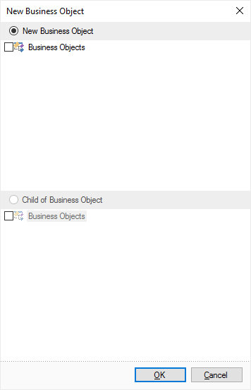
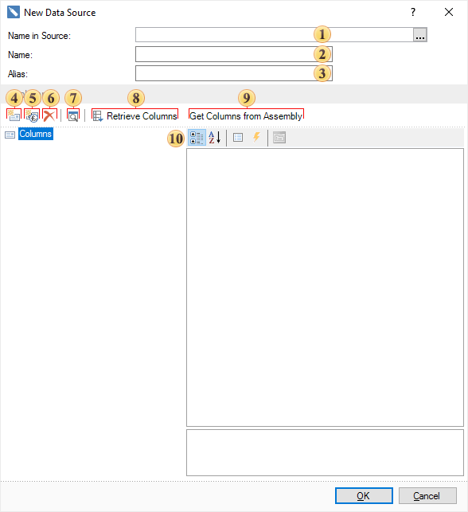
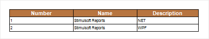
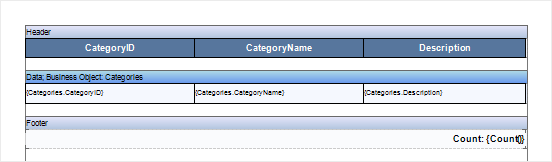
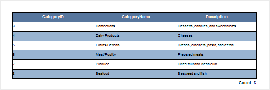

# Business Objects in Net, Web

Business Object is a data type, which is a set of objects related to each other, using what it is possible to present data in various structures: tables, lists, arrays, etc. These data can be passed to a reporting tool based on them the report can be rendered. Business Objects are created, registered and passed to the report generator from code.


### Filling the Business Objects manually in .NET

This example creates a report with a business object. First we need to create the structure of the business object. Below is a sample code to create a business object class:


**C#**

```csharp
...
public class MyObject
{
    public class Category
    {
        public int number;
        public int Number
        {
            get
            {
                return number;
            }
        }

        public string name;
        public string Name
        {
            get 
            { 
                return name;
            }
        }

        public string description;
        public string Description
        {
            get 
            {
                return description;
            }
        }
    }

    public Category[] list = null;
    public Category[] List
    {
        get
        {
            return list;
        }
    }
}
...
```

Now, you should populate the business object. Below is an example of code to populate a Business Object is with data:


**C#**

```csharp
...
MyObject obj = new MyObject();
obj.list = new MyObject.Category[2];

MyObject.Category c1 = new MyObject.Category();
c1.number = 1;
c1.name = "Cat1";
c1.description = "desc for n1";

MyObject.Category c2 = new MyObject.Category();
c2.number = 2;
c2.name = "Cat2";
c2.description = "desc for n2";

obj.list[0] = c1;
obj.list[1] = c2;

StiReport mainreport = new StiReport();
mainreport.RegBusinessObject("MyObject", obj);
mainreport.Design();
...
```


### Using Business Object in Report

After that, the business object is created, filled with data, registered and passed to the reporting tool. In order to create a report in the designer using business objects, you should create a data description in the report dictionary. To do this, select MyObject (created Business Object) in the report dictionary in and choose New Business Object... from the context menu or the menu New Item. After selecting this command, the window will open a New Business Object, in which you should specify the Child Business Object and select lists of data. The picture below shows the dialog New Business Object.




After you click Ok, you will be shown the second dialog box form of the New Business Object, where you can change the detail business object. The picture below shows the second dialog box form of the New Business Object.





 The field Category displays the category name. When you create a business object the field is not editable and is purely informative. Also, it may be empty, as in this case.

 The field Name is used to specify the name of the business object. This field is always available for editing, and, in this case, the name List is used.

 The field Alias specifies an alias of the business object. This field is always available for editing, and, in this case, the name List is used.

 The button New Column. Pressing it a new data column will be created in the business object. It should be noted that the data column created this way is a virtual data column and it does not contain actual data.

 The button New Calculated Column is used to insert a new calculated column into the business object.

 The button Delete is used to delete selected data columns. If you select a bookmark Columns, then all the columns which are in the tab will be deleted.

 The button Retrieve Columns is used to get the data column from the business object.

 The button Get Columns from Assembly will open the dialog Open Assembly, in which you may choose an assembly file. After selecting the file, press the button Open and, from this file, data columns will be extracted, if they are present there.

 The panel Columns consists of three fields. In these fields show a list of columns, their properties, and a description of these properties.


Press the Ok button once the fields are filled and parameters are specified. After that, in the data dictionary of the report a description of a new business object will be created, which can be used to create reports. The picture below shows a report built using a business object:





### Provide the data to business objects from the data source in .NET

Created business objects that are registered and passed to the report generator, but do not contain the actual data are called a description of business objects. Using the description of the business object, you can create a report template (define the structure and design the report), and then, before building, connect the real data and render a report. This is useful if you want to create reports with the same structure and design, but with different data. Create a structural description of the business object first. Below is a sample code to create a business object class:


**C#**

```csharp
...
public class MyObject
{
    public class Category
    {
        public int categoryID;
        public int CategoryID
        {
            get
            {
                return categoryID;
            }
        }

        public string categoryName;
        public string CategoryName
        {
            get 
            {
                return categoryName; 
            }
        }

        public string description;
        public string Description
        {
            get 
            {
                return description; 
            }
        }

    }

    public Category[] list = null;
    public Category[] Categories
    {
        get
        {
            return list;
        }
    }
}
...
```

You then need to create a new business object class, register and pass it to the report generator. Below is a sample code to create and register a new business object:


**C#**

```csharp
...
MyObject.Category obj = new MyObject.Category();
int busobjLevel = 1;

StiReport report = new StiReport();
report.RegBusinessObject("Categories", obj);
report.Dictionary.SynchronizeBusinessObjects(busobjLevel);
report.Design();
...
```

Now with help of the created description of the business object, create a report template in the designer. The picture below shows a report template created with the description of the business object:




Once a report template is created, you can save it, for example, to the following path D:\\Report.mrt. Because the description of the business object does not contain the actual data, in order to render a report, you will get the real data to business objects, in our example we take the data from the database Northwind. For a start, create a connection to the database in Visual Studio. After that, put the code to obtain data for the business object. Getting real data for the business object occurs immediately before the report. Here is the code to obtain data for the business object:


**C#**

```csharp
...
int busobjLevel = 1;

StiReport report = new StiReport();
report.Load("D:\\Report.mrt");

using (NorthwindDataContext context = new NorthwindDataContext())
{
    var categories =
        from c in context.Categories
        select new { c.CategoryID, c.CategoryName, c.Description };

    report.RegBusinessObject("Categories", categories);
    report.Show();
}
...
```

After that, the report generator will receive the data for the business object from the specified source, in this case from the database Northwind. Then, the report will be rendered by the existing template. The picture below shows the rendered report:





### Business objects in Web

Creating, filling, signing and sending business objects to the Web is almost the same as in .NET. First, create a class of the business object that is identical as in .NET. Next, create an object of the business object class, register it manually fill data and pass them. Here are the differences that, instead of the mainreport.Design() method, you should use the StiWebDesigner1.Design(mainreport) method. Also perform synchronization using the mainreport.Dictionary.SynchronizeBusinessObjects(), because in the Web designer it is not possible to create a description of the business object from the data dictionary (the description can only be created from code). Below is a sample code to create, fill, register and pass the business objects:


**C#**

```csharp
...
MyObject obj = new MyObject();
obj.list = new MyObject.Category[2];

MyObject.Category c1 = new MyObject.Category();
c1.number = 1;
c1.name = "Cat1";
c1.description = "desc for n1";

MyObject.Category c2 = new MyObject.Category();
c2.number = 2;
c2.name = "Cat2";
c2.description = "desc for n2";

obj.list[0] = c1;
obj.list[1] = c2;

int busobjLevel = 1;

StiReport mainreport = new StiReport();
mainreport.RegBusinessObject("MyObject", obj);
mainreport.Dictionary.SynchronizeBusinessObjects(busobjLevel);
StiWebDesigner1.Design(mainreport);
...
```

Just as in .NET, in Web you can create a description of the business objects first, then the report template, and then connect the data source with the real data and render a report. Create a description of the business object. But previously you have to make the class of the business object that is identical to the class of business object in .NET. Here is an example of writing a business object:


**C#**

```csharp
...
MyObject.Category obj = new MyObject.Category();
int busobjLevel = 1;

StiReport report = new StiReport();
report.RegBusinessObject("Categories", obj);
report.Dictionary.SynchronizeBusinessObjects(busobjLevel);
StiWebDesigner1.Design(report);
...
```

Now with the description created, design a report template identical to .NET. Once a report template is created, you can save it, for example to the following path D:\\Report.mrt. Since the description of the business object does not contain the actual data, in order to build a report, you should get the real data to business objects, in this example, we take the data from the database Northwind. First, create a connection to the database in Visual Studio. After that, write the code to obtain data for the business object. Getting real data for the business object occurs immediately before the report. Here is the code to obtain data for the business object:


**C#**

```csharp
...
int busobjLevel = 1;

StiReport report = new StiReport();
report.Load("D:\\Report.mrt");

using (NorthwindDataContext context = new NorthwindDataContext())
{
    var categories =
        from c in context.Categories
        select new { c.CategoryID, c.CategoryName, c.Description };

    report.RegBusinessObject("Categories", categories);
    StiWebViewer1.Report = report;
}
...
```
