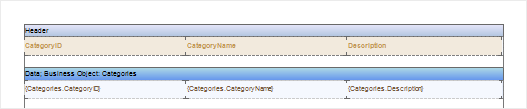
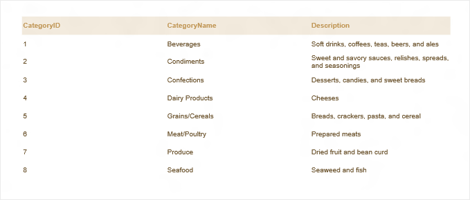

# Business Objects in UWP

In order to pass the business objects in UWP, you should use the following methods:


### The method of saving a dictionary structure

The method of saving the structure of the dictionary file *.dct, for further opening it in the report designer and creating a report. In this case, only the structure of the **Dictionary** is remained. The structure contains a description of business objects. Here is the code that implements this method:


**C#**

```csharp
...
var picker = new Windows.Storage.Pickers.FileSavePicker(); picker.FileTypeChoices.Add("Files Dictionary (*.dct)", new System.Collections.Generic.List<string>() { ".dct" });picker.SuggestedFileName = "ReportDictionary1";picker.SuggestedStartLocation = Windows.Storage.Pickers.PickerLocationId.ComputerFolder;var storageFile = await picker.PickSaveFileAsync();if (storageFile != null){
    StiReport report = new StiReport();
    report.RegBusinessObject("Categories", "Categories", GetData()); 
    report.Dictionary.SynchronizeBusinessObjects(3); await report.Dictionary.SaveAsync(storageFile); 
}
...
```


### The method of saving a report

The method of saving to a file ***.mrt**, with the structure of the report dictionary. The structure of the dictionary includes a description of the business object. Here is the code that implements this method:


```
...
var picker = new Windows.Storage.Pickers.FileSavePicker();picker.FileTypeChoices.Add("Files report (*.mrt)", new System.Collections.Generic.List<string>() { ".mrt" });picker.SuggestedFileName = "Report1";picker.SuggestedStartLocation = Windows.Storage.Pickers.PickerLocationId.ComputerFolder;var storageFile = await picker.PickSaveFileAsync();if (storageFile != null){
    StiReport report = new StiReport();report.RegBusinessObject("Categories", "Categories", GetData()); report.Dictionary.SynchronizeBusinessObjects(3); await report.SaveAsync(storageFile);
}
...
```

Next, consider creating a report template with the description of the business objects, filling them with real data and reporting.


### Creating a report template with a description of the business object

To do this, open a saved report with the structure of the dictionary or open the dictionary data in the report designer. Next, using the description, you should create a report template. For example, dragging the business object to the page. When dragging the dialogue form Data will be invoked, which determines the field references of the business object, the basis of the report - Data Band or Table, as well as to add a Header Band and Footer Band to the report template. You should also edit report components. The picture below shows the created report template:




The picture above shows that the report template is created. Since it was created with a description of the business object that does not contain the actual data, the report can not be rendered. For rendering a report, a business object should be filled with real data. This can be done manually by specifying values ​​for the fields, or to connect the data source from which the data will be delivered. Created report template should be saved, for example, in the folder "My Documents" with the name Report.mrt.


### Filling the business object with the real data

Filling the business object in this example, will be done from the installed database. First, we need to create a connection to this database in Visual Studio. After this, you should specify the filling code of the business object. Filling the actual business object data directly before the report. Here is the code to fill the business object:


**Xaml**

```
...
<Page>
    <viewerRT:StiViewerControl x:Name="viewerControl" />
</Page>
...
```


**C#**

```csharp
...
StiReport report = new StiReport();
StorageFile file = await KnownFolders.PicturesLibrary.GetFileAsync("");
await report.LoadAsync(file);

using (NorthwindDataContext context = new NorthwindDataContext())
{
    var categories =
        from c in context.Categories
        select new { c.CategoryID, c.CategoryName, c.Description };

    report.RegBusinessObject("Categories", categories);
    await report.RenderAsync();

    viewerControl.Report = report;
}
...
```

After that, the report generator fills the business object with data from the specified data source, in this case from the database Northwind, the table Categories. Then, the report will be rendered by the existing template. The picture below shows the rendered report:



