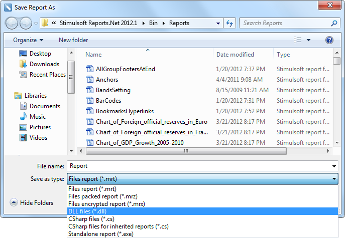

## Reports as Assemblies


Stimulsoft Reports reports generation has the unique ability to compile reports to the .Net Framework assembly. Use the **File | Save Report As…** menu for saving a report to the assembly.





For loading a report from the assembly the following code is used:


C#:

```
StiReport report = StiReport.GetReportFromAssembly("report.dll");
```


VB.NET:

```
Dim Report As StiReport = StiReport.GetReportFromAssembly("report.dll")
```


Reports, which are loaded from assembly, do not require compilation. It is impossible to edit such reports in the report designer.
