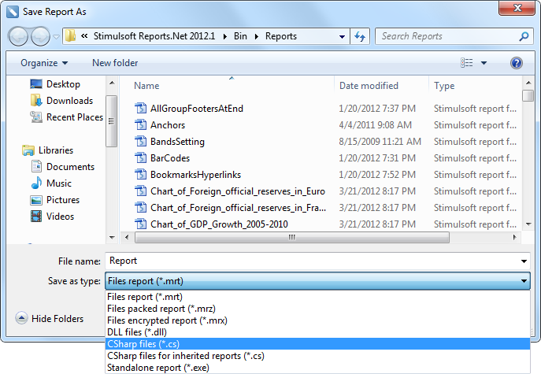
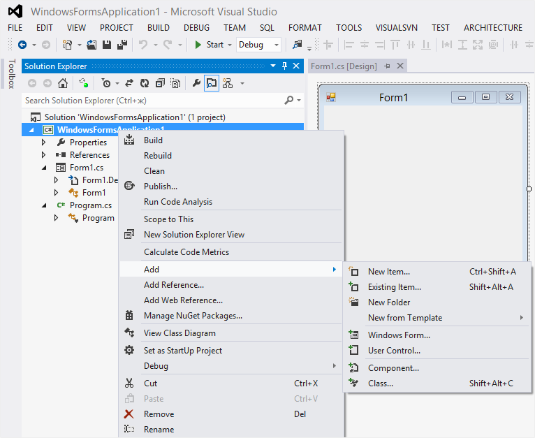

## Reports as Source Code

For automatic generation a report code the standard **.NET Framework** languages are used. When using **C#**, it is possible to write the same code as in **Visual Studio.NET**. The same can be said about **VB.NET**, where a report code can be saved and in the **Visual Studio.NET** project. Use the **File | Save Report As…** menu for saving a report code

* **Notice:** The report code is completely compatible with C# and VB languages. Therefore, the report code can be saved and used in the Visual Studio.NET project.

