## Icons

With the help of icons information about the components, settings and tools applied to these components in the reports is displayed. These icons are filtering, conditions and events of the inherited report, dynamic collapsing, dynamic sorting, order, quick information. By default, these icons are displayed in the left to right order in a component, but if necessary, they can be displayed in the right to left order. It is possible using the properties:

  * ConditionsRightToLeft,

  * EventsRightToLeft,

  * InheritedRightToLeft,

  * InteractionCollapsingRightToLeft,

  * InteractionSortRightToLeft,

  * OrderAndQuickInfoRightToLeft,

  * FiltersRightToLeft,

  * QuickButtonsRightToLeft.


They belong to the **StiOptions.Viewer.Pins** class. Consider these features in more detail:


* The mode of displaying the Conditions icon depends on the value of the **ConditionsRightToLeft** property. For example, if to place a Condition in the DataBand, then the Conditions icon will be displayed by default in the lower left corner of this DataBand, because the **ConditionsRightToLeft** property is set to **false**. The picture below shows an example of a report template with the Conditions icon in the left to right mode:


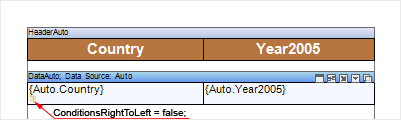

Set the **ConditionsRightToLeft** property to true to change the position of the icon:


**C#**

```csharp
...
StiOptions.Viewer.Pins.ConditionsRightToLeft = true;
...
```

And then the icon will be displayed in the "**right to left**" mode, i.e. in the lower right corner of the DataBand. The picture below shows an example of a report template with the Conditions icon in the right to left mode:


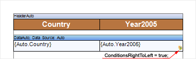

* Change the value of the **EventsRightToLeft** property to change the location of the Events icon. For example, if to place an Event in the text component, then the Events bookmark will be displayed by default in the upper left corner of the text component, because the **EventsRightToLeft** property is set to **false**. The picture below shows an example of a report template with the Events icon in the left to right mode:


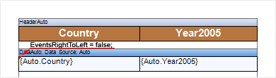

Set the **EventsRightToLeft** property to true to change the location of the **Events** icon.


**C#**

```csharp
...
StiOptions.Viewer.Pins.EventsRightToLeft = true;
...
```

The picture below shows an example of a report template with the **Events** icon in the right to left mode:


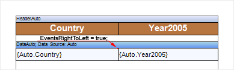

* The **InheritedRightToLeft** property is used to change the location of the Inherited icon. By default, this property is set to false, i.e. the icon appears in the left to right mode. The picture below shows an example of a report template with the Inherited icon in the left to right mode:


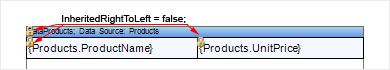

If the **InheritedRightToLeft** property is set to **true**


**C#**

```csharp
...
StiOptions.Viewer.Pins.InheritedRightToLeft = true;
...
```

the Inherited icon will appear in the right to left mode (see the picture below):


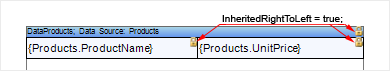

* The **InteractionCollapsingRightToLeft** property is used to change the location of the Collapsing icon. By default, this property is set to false, i.e. the icon appears in the left to right mode. The picture below shows an example of a report template with the Collapsing icon in the left to right mode:


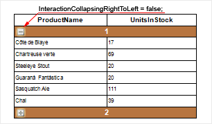

If the **InteractionCollapsingRightToLeft** property is set to **true**


**C#**

```csharp
...
StiOptions.Viewer.Pins.InteractionCollapsingRightToLeft = true;
...
```

Collapsing icons will appear in the right to left mode (see the picture below):


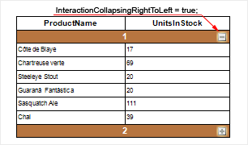

* The **InteractionSortRightToLeft** property is used to change the location of the **InteractionSort** icon. By default, this property is set to false, i.e. the icon appears in the left to right mode. The picture below shows an example of a report template with the **InteractionSort** icon in the left to right mode:


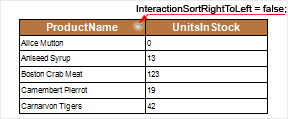

If the **InteractionSortRightToLeft** property is set to **true**


**C#**

```csharp
...
StiOptions.Viewer.Pins.InteractionSortRightToLeft = true;
...
```

the **InteractionSort** icon will appear in the right to left mode (see the picture below):


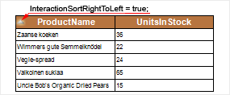

* The **OrderAndQuickInfoRightToLeft** property is used to change the location of the **Show Order** icon. By default, this property is set to false, i.e. the icon appears in the left to right mode. The picture below shows an example of a report template with the Show Order icon in the left to right mode:


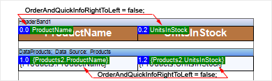

If the **OrderAndQuickInfoRightToLeft** property is set to **true**:


**C#**

```csharp
...
StiOptions.Viewer.Pins.InteractionSortRightToLeft = true;
...
```

the **Show Order** icon will appear in the right to left mode (see the picture below):


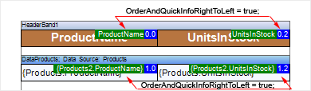

* The **FiltersRightToLeft** property is used to change the location of the Filters icon. By default, this property is set to false, i.e. the icon appears in the left to right mode. The picture below shows an example of a report template with the Filters icon in the left to right mode:


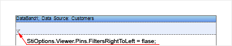

If the **FiltersRightToLeft** property is set to **true**:


**C#**

```csharp
...
StiOptions.Viewer.Pins.FiltersRightToLeft = true;
...
```

the **Filters** icon will appear in the right to left mode (see the picture below):


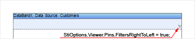

* The **QuickButtonsRightToLeft** property is used to change the location of the **QuickButtons** icon. By default, this property is set to false, i.e. the icon appears in the left to right mode. The picture below shows an example of a report template with the Filters icon in the left to right mode:


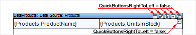

If the **QuickButtonsRightToLeft** property is set to **true**:


**C#**

```csharp
...
StiOptions.Viewer.Pins.QuickButtonsRightToLeft = true;
...
```

the **QuickButtons** icon will appear in the right to left mode (see the picture below):


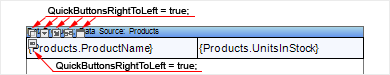
