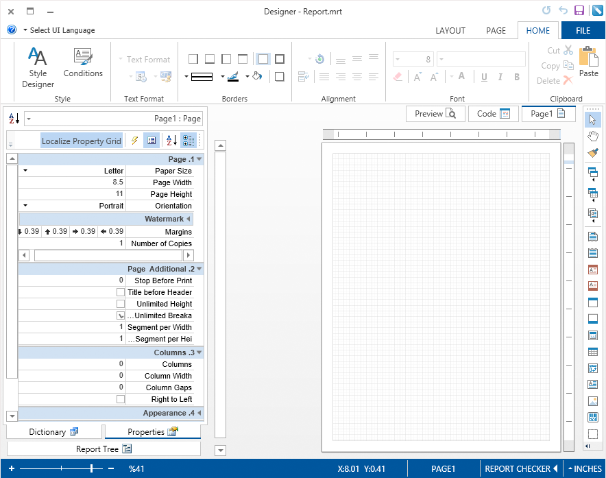

# WPF Designer and Viewer

In the designer and WPF report viewer it is possible to set the mode of showing controls in the right to left direction. By default, all controls are displayed in the left to right order. It is possible to change this. The **FlowDirection** property is used for this. If the property is set to **LeftToRight**, then controls are shown from left to right (see the code below).


**XAML**

```
...
FlowDirection="LeftToRight"
...
```

The picture below shows the left to right order of showing controls in the designer and viewer. If the **FlowDirection** property is set to **RightToLeft**, then controls are shown in the right to left order. See the code below how to achieve this result.


**XAML**

```
...
FlowDirection="RightToLeft"
...
```

The picture below shows the right to left order of showing controls in the designer and viewer.




As can be seen from the picture above, the order of showing report pages in the viewer also depends on the value of the **FlowDirection** property.
