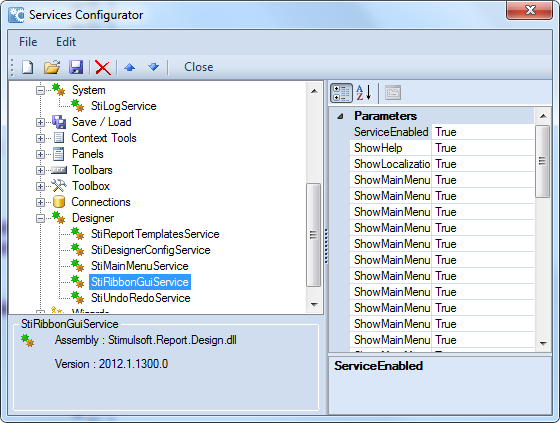

## Report Programming Language

The report generator uses a single specified programming language to generate the report code and handle report events. If the current programming language of a report does not suit your requirements you can change it.  The options are currently C# or VB.NET.

Changing The Language Of The Current Report

To do this select **File | Report Setup**.  A new dialog will be displayed

In the **Language** group select a new programming language and press **Ok**. The current programming language will then be changed.

> **Information**
>
> The underlying report code will have to be regenerated for the entire report, and any changes which have been made within the report code will be lost.

It is not convenient to change the programming language each time a report is rendered, so Stimulsoft Reports allows you to set the default programming language used by all new reports.

To do this you should use the Services Configurator utility. All programming languages in Stimulsoft Reports are located under the Languages node. The language which is shown first in the list is the default programming language. For example, on the picture below the C# programming language is the default programming language.  To make VB.Net the default programming language simply drag the **StiCSharpLanguage** service down one position with the mouse or use the up and down buttons to re-order the languages.

