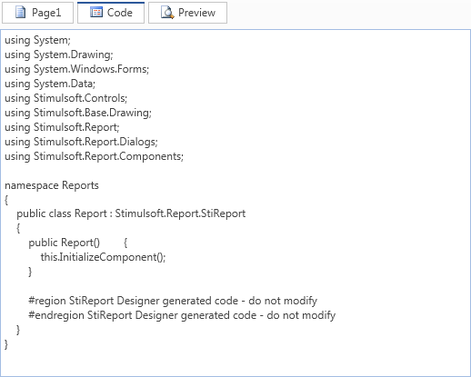

## Report Code

When you create a new report its source code, often called the report script, is generated automatically using either C# or VB.NET programming language depending on the currently selected default. You can use only one of these programming languages at a time


In the report code the structure and initialization of the report class, which itself inherits from the StiReport class, are described. When adding new pages, components or changing any parameters of a report, those changes are automatically recorded within the class. The report class therefore contains a description of all components, data, events, report properties, and data source structures for the report. Any events specified by the user are also added to the report code.


For the ultimate in power and flexibility Stimulsoft Reports allows direct editing of the report code - if you want something not provided by the available properties and features of the designer you can actually code your own features within the report. When writing events or another code in the report, you use the standard syntax of the selected .Net Framework programming language i.e. if the language is set to C# you write code using C# syntax.


> **Information**
>
> The report code is generated in **C#** or **VB.Net** programming language. All events and any another code in this report must be written in the currently selected language.

When rendering reports, compilation of the report class occurs first. After that the compiled report is executed.


> **Information**
>
> The report code is compiled using the .NET Framework compiler.

To see the report code click the Code tab in the designer.  The code will then be displayed:




To edit the code, simply start typing in the appropriate place.


> **Infromation**
>
> Do not change preprocessor directives or automatically updated code.

Whilst Stimulsoft  Reports allows you to directly edit the report code, it is important to remember that it is impossible to make changes in the parts of the report code which are automatically updated - such changes will be lost when the next update takes place. The automatically updated report code is enclosed in Region preprocessor directives:


**VB.NET**

```vbnet
...
//At the beginning of the automatically updated code
#region StiReport Designer generated code - do not modify
 
//Automatically updated code goes here 
 
//the end of the automatically updated code
#endregion StiReport Designer generated code - do not modify
...
```

Any code that you write within the report must be written outside these Regions.
