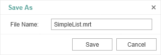

# Saving Reports

> **Information**
>
> Since dashboards and reports use the same unified template format - MRT, methods for loading the template and working with data, the word “report” will be used in the documentation text.

The **HTML5 Designer** component has two ways of saving the report which are available in the main menu and in the main panel of the designer - **Save Report** and **Save As**. In turn, each of these ways has its own modes and settings.


### Saving a report and dashboard on the server side

To save the edited report on the server side, you should set the **onSaveReport** special event which will be called when you select the **Save Report** menu item or click the **Save** button on the main panel of the designer.

An editable report will be passed in the arguments of the event. That report can be saved, for example, in a JSON string and then transferred to the server side.


**designer.html**

```html
...
designer.onSaveReport = function (args) {
    args.preventDefault = false;
    var jsonReport = args.report.saveToJsonString();
}
...
```

> **Information**
>
> Additional details about the `onSaveReport` event handler argument are provided in the [Designer Events](Designer_Events.md).

By default, after saving the report, the designer continues working without displaying any messages. If necessary, after saving the report, it is possible to display a dialog box with an error or a text message. The special static function **showError()** is intended for this.


**designer.html**

```html
...
designer.onSaveReport = function (args) {
    args.preventDefault = false;
    Stimulsoft.System.StiError.showError("Some message after saving", true);
}
...
```

You can get a report name from the designer save dialog or an original report name.


**designer.html**

```html
...
var designer = new Stimulsoft.Designer.StiDesigner(designerOptions, "StiDesigner", false);
designer.renderHtml("content");

designer.onSaveReport = function (args) {

    //a flag to prevent further processing of the event
    args.preventDefault = false;
    
    //Report name from the designer save dialog
    var reportName = args.fileName;
    
    //Original report name from properties
    var reportName = args.report.reportName;
}
...
```

The function takes the error text and a flag as arguments that define the type of the window. The text can contain either a save error message or a warning, or any other message. If **true** is set as the second argument of the function, then an error window will be displayed. If **false** is set, the pop-up window with the error message will be displayed.


### Saving reports and dashboards on the client side

No additional designer settings are required to save the edited report on the client side as a file.  It is enough to click the **Save As** main menu item. The dialog box will be displayed. In this dialog you can change the name of the report file. The file will be saved to the local disk of the computer.





The **HTML5 Designer** component provides the ability to change the behavior of the specified save option. The special **onSaveReportAs** designer event is used for this. If you use this event, the report will be saved on the server side. It works similar to the **onSaveReport** event.


**designer.html**

```html
...
designer.onSaveAsReport = function (args) {
    args.report.repotName = "Report";

    // Save the report template
    var jsonReport = args.report.saveToJsonString();
}
...
```
