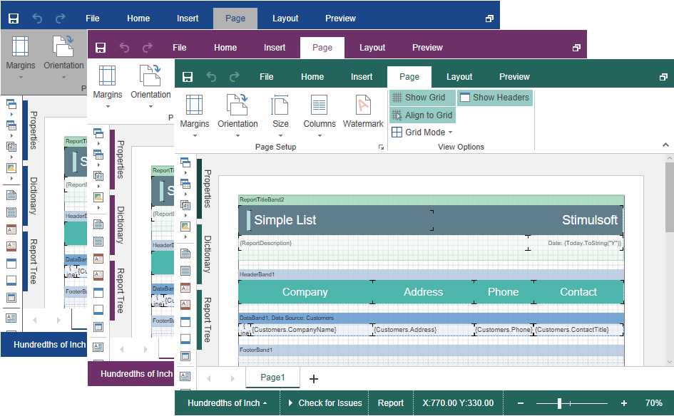

# Using Themes

You can change the appearance of visual controls in the **HTML5 Designer** component. You can use the theme component option or the **setTheme()** method for this.


**designer.html**

```html
...
var options = new Stimulsoft.Designer.StiDesignerOptions();
options.appearance.theme = Stimulsoft.Designer.StiDesignerTheme.Office2022WhiteBlue;
...
designer.setTheme(Stimulsoft.Designer.StiDesignerTheme.Office2022WhiteBlue);
...
```

There are currently **2 themes** available with different color accents. As a result, **more than 50** variants of the appearance are available. This allows you to customize the appearance of the designer for almost any design of the Web project.



