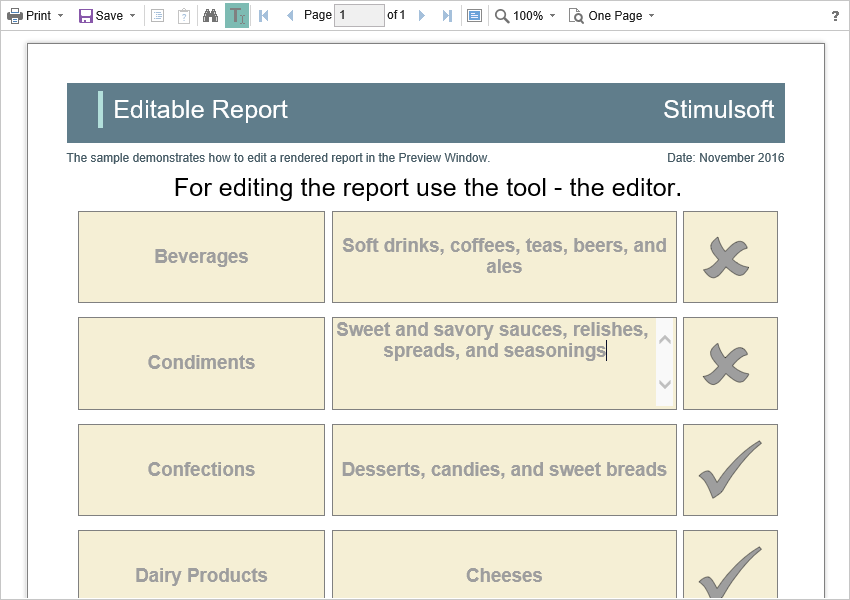

# Editing Report

The **HTML5 Viewer** component has the ability to edit report items, such as text boxes and check boxes. In order the editing be possible, in the report template, you should mark the required components as editable. After displaying a report in the viewer, you need to click the corresponding button on the viewer panel to start editing. After editing, it is necessary to click the button once more, and all changes will be applied to the report.

For the report edit mode, no special settings of the viewer required.

> **Information**
>
> The edited settings will be applied when you print or export a report, and the original report remains unchanged. After restarting the viewer, all the values will be returned to the initial ones.
