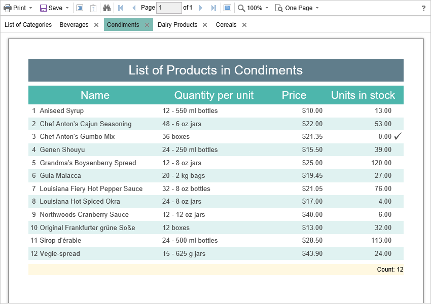

# Dynamic Sorting, Collapsing, and Drill-Down

The **HTML5 Viewer** component supports dynamic sorting, collapsing, and drill-down reports. Dynamic sorting provides the ability to change the direction of sorting in a rendered report. To do this, click on the component that has the dynamic sorting enabled. Dynamic sorting is carried out in the following directions - **Ascending** and **Descending**. Each time the component is clicked, the sorting direction is reversed.


Multi-level sorting is allowed in the report. To do this, hold down the **Ctrl** key and sequentially click on the sorted components in the report. To reset sorting, you can click on any sorted component without holding down the **Ctrl** key.


A report with dynamic collapsing is an interactive report in which blocks can collapse/expand their content when you click on the block title. Report elements, which can be collapsed/expanded, are indicated by special icons - **[-]** or **[+]**.


When using drill-down under the main panel of the viewer, the drill-down panel with tabs for drill-down reports will be displayed. The currently displayed report will be highlighted.




For the work with dynamic sorting, folding and detailing of reports, no additional settings of the viewer are required. The special **onInteraction** event is used to perform any actions before sorting, minimizing or detailing a report. It will be triggered by interactive actions of the viewer. For each type of interactivity, the viewer provides a certain type of action:

* **Sorting** – when using column sorting;

* **DrillDown** – when using drill-down in reports;

* **Collapsing** – when using collapsing report blocks.

**viewer.html**

```html
...
viewer.onInteraction = function (args) {
    switch (args.action) {
        case "Sorting":
            break;

        case "DrillDown":
            break;

        case "Collapsing":
            break;
    }
}
...
```
