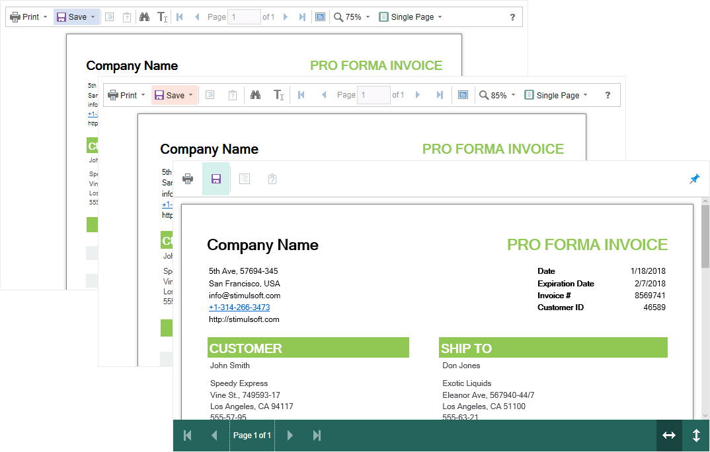

# Viewing Modes

The **HTML5 Viewer** component has two modes for displaying reports - with and without scrollbars. By default, the view mode without scrollbars is set. To enable the scrollbar view mode, set the value of the **scrollbarsMode** property to **true**.

**viewer.html**

```html
...
var options = new Stimulsoft.Viewer.StiViewerOptions();
options.appearance.scrollbarsMode = true;
...
```


In the first mode (without scrollbars), the viewer displays a page or report entirely, automatically stretching the preview space. If the width and height are specified, the viewer will truncate the page that is out of bounds. In the second mode, unlike the first one, when the page is out of bounds of the viewer's size, no truncation will be performed. Scrollbars will appear, using which you can view the entire page or report.

> **Information**
>
> In the report mode with scrollbars, you should set the height of the viewer; otherwise the default height will be set to **650 pixels**.


The **HTML5 Viewer** component has the full-screen report and dashboard mode. By default, the standard view mode is enabled; the viewer has the specified size in the settings. To enable the full-screen mode, set the **fullScreenMode** property to **true**.

**viewer.html**

```html
...
var options = new Stimulsoft.Viewer.StiViewerOptions();
options.appearance.fullScreenMode = true;            
...
```

Also, to enable or disable the full-screen mode, you can use the corresponding button on the control panel of the viewer.

The **HTML5 Viewer** component has three modes to display reports - page-by-page, entire report, and tabular display of report pages. To control the modes, the **viewMode** property is used. It can have one of the specified values - **SinglePage**, **Continuous**, **MultiplePages**.

**viewer.html**

```html
...
var options = new Stimulsoft.Viewer.StiViewerOptions();
options.toolbar.viewMode = Stimulsoft.Viewer.StiWebViewMode.Continuous;
...
```


The **HTML5 Viewer** component supports interaction on a regular PC and touch screen displays and on mobile devices. The **i****nterfaceType** property allows you to control the interface modes. The property can have one of the following values:

* **Auto** – the interface of the viewer is determined automatically depending of the device that the report is displayed on. This is the default value.

* **Mouse** – the standard interface with a mouse control will be used for all the screen types.

* **Touch** – the touch interface will be used to control the viewer. The interface design was optimized for the touch screen displays. The elements of the viewer interface are increased in size to simplify the control of the viewer and to improve its usability.

* **Mobile** - the mobile interface will be used to control the viewer for all the screen types. The mobile interface was designed to control the viewer using mobile smartphone displays. This interface design was simplified and adapted to use with the smartphones.


**viewer.html**

```html
...
var options = new Stimulsoft.Viewer.StiViewerOptions();
options.appearance.interfaceType = Stimulsoft.Viewer.StiInterfaceType.Auto;
...
```



