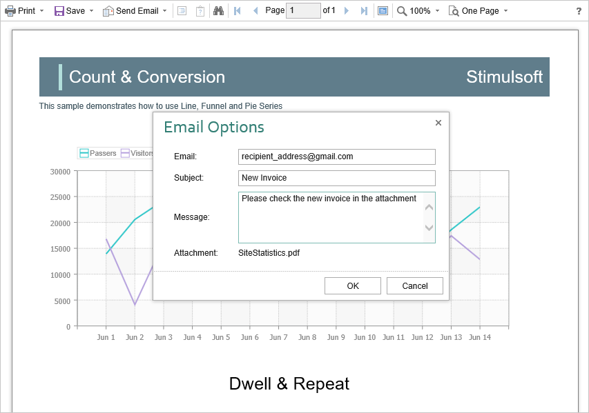

# Sending Report by Email

> **Information**
>
> Please note that the Send Report by Email option is available only for reports, and not for dashboards.

The **HTML5 Viewer** component provides the ability to send reports by email. To activate this feature, you should set the **showSendEmailButton** property of the viewer to **true**, and add the **onEmailReport** event handler.


**viewer.html**

```html
...
var options = new Stimulsoft.Viewer.StiViewerOptions();
options.toolbar.showSendEmailButton = true;
...
```


**viewer.html**

```html
...
viewer.onEmailReport = function (args) {
    // args.settings -  send email form
    // args.settings.email  -  email adress
    // args.settings.subject  -  email subject
    // args.settings.message  -  email message
    
    // args.format  -  export format - PDF, HTML, HTML 5, Excel2007, Word2007, CSV
    // args.fileName - report file name (name of attachement)
    // args.data  -  byte array with exported report file
}
...
```


In the **o****nEmailReport** event you can find the type of the export, get the report, and also get the report export settings and change them, if necessary. Also in this event, you should set parameters of sending e-mail, such as sender address, server name, port number, user name and password - all these parameters will be used to send email.

When you send a report by email the menu to select the attachment format is displayed. This matches the menu to select an export format. After choosing the format, the dialog to insert send e-mail parameters such as email recipient, subject and message will pop-up.





After the confirmation of sending, the **onEmailReport** event described above will be triggered. You can check and correct the data entered in that form.

> **Information**
>
> Pure JavaScript does not have built-in e-mail methods, so the **StiViewer** component provides only an interface for sending email. To work with e-mails, you should use any server that supports work with e-mail. To the server side, the data for sending e-mails can be sent using an AJAX request or another convenient method.


The **HTML5 Viewer** component allows you to set default values for the send email form. The **defaultEmailAddress**, **defaultEmailSubject** and **defaultEmailMessage** properties can be used for this. By default, these properties are empty.

**viewer.html**

```html
...
var options = new Stimulsoft.Viewer.StiViewerOptions();
options.toolbar.showSendEmailButton = true;

options.email.defaultEmailAddress = "recipient_address@gmail.com";
options.email.defaultEmailSubject = "New Invoice";
options.email.defaultEmailMessage = "Please check the new invoice in the attachment";
...
```
