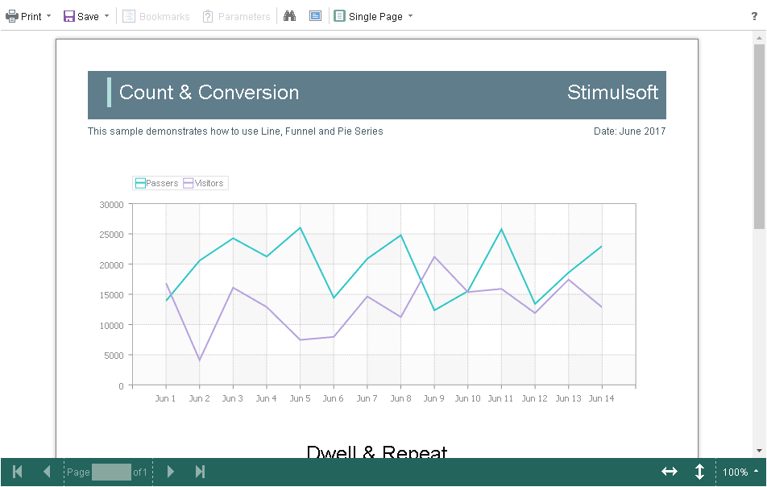

# Using Themes

The **HTML5 Viewer** component has the ability to change themes for visual controls. You can use the theme component option or the **setTheme()** method for this.


**viewer.html**

```html
...
var options = new Stimulsoft.Viewer.StiViewerOptions();
options.appearance.theme = Stimulsoft.Viewer.StiViewerTheme.Office2022WhiteBlue;
...
viewer.setTheme(Stimulsoft.Viewer.StiViewerTheme.Office2022WhiteBlue);
...
```

There are currently **8 themes** available with different color accents. As a result, **more than 60** variants of the appearance are available. This allows you to customize the appearance of the viewer for almost any design of the Web project.


By default, the viewer has only the top toolbar on which all the report controls are located. If necessary, the toolbar can be split into top and bottom parts. The top panel will contain the menu for printing and exporting the report, as well as the buttons for working with parameters and bookmarks. The bottom panel will contain controls to switch between the report pages and the menu to zoom pages. Use the **displayMode** property to enable this mode. The property has values **Simple** and **Separated**.


**viewer.html**

```html
...
var options = new Stimulsoft.Viewer.StiViewerOptions();
options.toolbar.displayMode = Stimulsoft.Viewer.StiToolbarDisplayMode.Simple;
options.appearance.scrollbarsMode = true;
...
```




In addition, it is possible to set the parameters of appearance for the main items of the viewer. For example, you can change the font and color for text of the control panel of the viewer, set the background of the viewer, set the color of page borders, etc. Below is a list of available properties that change the appearance of the viewer, and their default values.


**viewer.html**

```html
...
var options = new Stimulsoft.Viewer.StiViewerOptions();

options.appearance.backgroundColor = Stimulsoft.System.Drawing.Color.white;
options.appearance.pageBorderColor = Stimulsoft.System.Drawing.Color.red;
options.appearance.showPageShadow = false;

options.toolbar.backgroundColor = Stimulsoft.System.Drawing.Color.aqua;
options.toolbar.borderColor = Stimulsoft.System.Drawing.Color.darkGreen;
options.toolbar.fontColor = Stimulsoft.System.Drawing.Color.white;
options.toolbar.fontFamily = "Arial";
...
```
