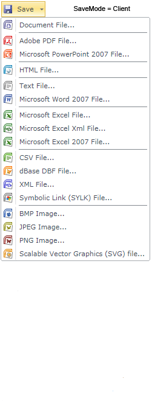
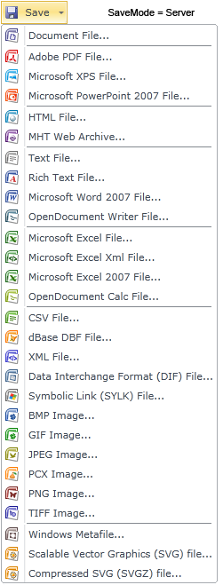
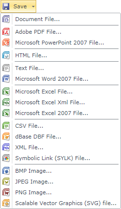
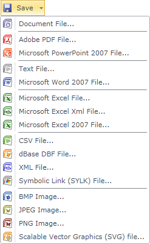

## Saving Mode

When you export a report to any format, saving the report will take place in one of the following saving modes: **Client** or **Server**. Using the **SaveMode** property it is possible to change the mode of saving. If the **SaveMode**  property id set to **Client**, then the report will be saved on the client-side of the **WebViewerSL** application by means of **Silverlight** without a server. If the **SaveMode** property is set to **Server**, then saving the report will take place directly on the server, and after saving the report will be transferred to the client-side. Depending on the value of the **SaveMode**  property user will see different the lists of export formats. The picture below shows lists of exports in various saving modes:







### Export Settings

A report opened in **WebViewerSL** can be exported to many different formats. The list of formats for export can be customized. In other words, you can hide unused export formats. Customization of the list of formats of exports can be made by means of WebViewerSL properties. **For example** the **HTML** format, in the **Client** saving mode. Showing of this format in the list of formats for export depends on the value of the **ShowHtmlButton** property. The picture below shows the complete list of formats in the **Client** save mode:




As can be seen from the picture above, the **HTML** format is displayed in the list of formats that corresponds to the **ShowHtmlButton** property set to **true**. If you set this property to false:


**Default.Aspx**

```
...
<cc1:StiWebViewerSL ID="StiWebViewerSL1" runat="server" ShowHtmlButton="False" />
...
```

then the **HTML** will not be displayed in the list of formats for exporting. The picture below shows a list of formats for exporting without the **HTML** format:




By default, all available formats are listed for exporting.
