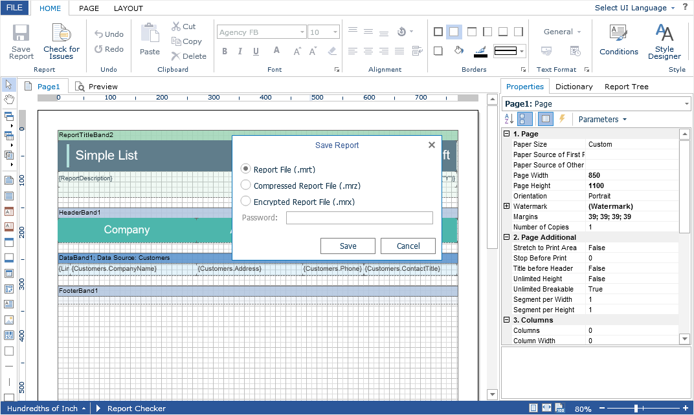

# Saving Reports

The **Flash Designer** component provides two ways of saving the report which are available in the main menu and in the main panel of the designer - **Save Report** and **Save As**. In turn, each of these ways has its own modes and settings.


### Saving reports on the server-side

To save the edited report on the server-side, you need to set the **SaveReport** action, which will be called when you select the **Save Report** menu item or click the **Save** button on the main panel of the report designer.


**Index.cshtml**

```
...
@Html.StiNetCoreDesignerFx(new StiNetCoreDesignerFxOptions() {
    Actions =
    {
        SaveReport = "SaveReport"
    }
})
...
```


**HomeController.cs**

```csharp
...
public IActionResult SaveReport()
{
    StiReport report = StiNetCoreDesignerFx.GetReportObject(this);
        
    // Save the report template
    // ...
    
    return StiNetCoreDesignerFx.SaveReportResult(this);
}
...
```

This action returns a response to the client-side of the designer about the result of saving the report. The response can be of several types - standard, boolean, string and integer.


**HomeController.cs**

```csharp
...
public IActionResult SaveReport()
{
    StiReport report = StiNetCoreDesignerFx.GetReportObject(this);
        
    // Save the report template
    // ...
    
    // Completion of the report saving without any dialog box
    return StiNetCoreDesignerFx.SaveReportResult(this);
    
    // Completion of the report saving with dialog box
    //return StiNetCoreDesignerFx.SaveReportResult(this, true);
    
    // Completion of the report saving with error dialog box
    //return StiNetCoreDesignerFx.SaveReportResult(this, 123);
    
    // Completion of the report saving with message dialog box
    //return StiNetCoreDesignerFx.SaveReportResult(this, "Some message after saving");
}
...
```

With a standard response (without parameters), no actions will occur on the client-side. After saving, the user will continue to work with the report.


When a true boolean value is returned, the designer displays a window about the successful saving of the report.

If you return an integer value, the user will receive a message about the error with saving the report and the error code where the error code is the passed integer value.

When you return a string value, a dialog box with the specified text will be displayed. The text can contain both a save error message or a warning, or any other message.


The **Flash Designer** component allows you to correct the report on the server-side while saving it. In order for the corrected report to be sent back to the client-side, it is necessary to transfer it as a parameter of the resulting method in the action of saving the report.


**HomeController.cs**

```csharp
...
public IActionResult SaveReport()
{
    StiReport report = StiNetCoreDesignerFx.GetReportObject(this);
    report.ReportAuthor = "Stimulsoft";
        
    // Save the report template
    // ...
    
    return StiNetCoreDesignerFx.SaveReportResult(this, report);
}
...
```


### Saving report on the client-side

No additional designer settings are required to save the edited report on the client-side as a file. It is enough to select the **Save As** menu item. When you click on it you will be asked to choose the format of saving the report. After the format is selected, the system save file dialog is displayed. In this dialog, you can specify the name of the report file and the folder in what to save.




The **Flash Designer** component provides the ability to change the behavior of the specified save option. For this purpose, the designer provides a special **SaveReportAs** action. If you use this action, the report will be saved on the server-side. This action will work similar to the **SaveReport** action.


**Index.cshtml**

```
...
@Html.StiNetCoreDesignerFx(new StiNetCoreDesignerFxOptions() {
    Actions =
    {
        SaveReportAs = "SaveReportAs"
    }
})
...
```


**HomeController.cs**

```csharp
...
public IActionResult SaveReportAs()
{
    StiReport report = StiNetCoreDesignerFx.GetReportObject(this);
        
    // Save the report template
    // ...
    
    return StiNetCoreDesignerFx.SaveReportResult(this);
}
...
```


### Saving settings

The report is saved in the background mode without reloading the page in the web browser window. If you need to visually control the process of saving the report, you should change the value of the **SaveReportMode** (or **SaveReportAsMode**) property of the designer to one of the three specified values - **Hidden** (default value), **Visible** or **NewWindow**.


**Index.cshtml**

```
...
@Html.StiNetCoreDesignerFx(new StiNetCoreDesignerFxOptions() {
    Actions =
    {
        SaveReportAs = "SaveReportAs"
    },
    Behavior =
    {
        SaveReportAsMode = StiSaveMode.Visible
    }
})
...
```

If the **SaveReportMode** property is set to **Visible**, the report save event will be called in the current browser window in the normal (visible) mode using the POST request. If the **SaveReportMode** property is set to **NewWindow**, the report save event will be called in a new window of the web browser. By default, this property is set to **Hidden** - the report save event is called in the background using the AJAX request and is not shown in the browser window. The same values and behavior are applicable to the **SaveReportAsMode** property.


Since the designer has the ability to create a new report, then, when you save it, you may need to know if the previously loaded report is saved or this is a new report. To do this, you can use the additional method - **GetRequestParams()**.


**HomeController.cs**

```csharp
...
public IActionResult SaveReport()
{
    StiReport report = StiNetCoreDesignerFx.GetReportObject(this);
    StiRequestParams requestParams = StiNetCoreDesignerFx.GetRequestParams(this);
        
    if (requestParams.Designer.IsNewReport)
    {
        // Save the new report
    }
    else
    {
        // Save the edited report
    }
    
    return StiNetCoreDesignerFx.SaveReportResult(this);
}
...
```


> **Information**
>
> After saving a report first time, the report will no longer be considered as new and the specified checkbox will have a negative value.

The **Flash Designer** component provides the ability to automatically save a report after a certain interval of time. To enable this option, set the value for the **AutoSaveInterval** property. It is specified in minutes. Through this specified interval, the designer will automatically initiate the **SaveReport** action to save reports. By default, the property has **0** value, i.e. the automatic saving of the report is disabled.


**Index.cshtml**

```
...
@Html.StiNetCoreDesignerFx(new StiNetCoreDesignerFxOptions() {
    Actions =
    {
        SaveReport = "SaveReport"
    },
    Behavior =
    {
        AutoSaveInterval = 3
    }
})
...
```
