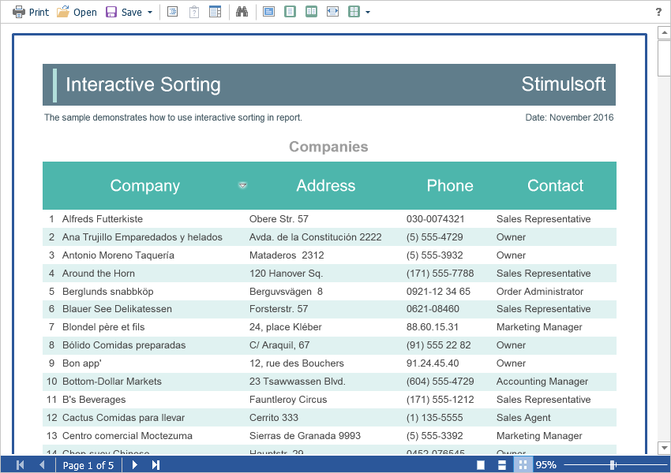
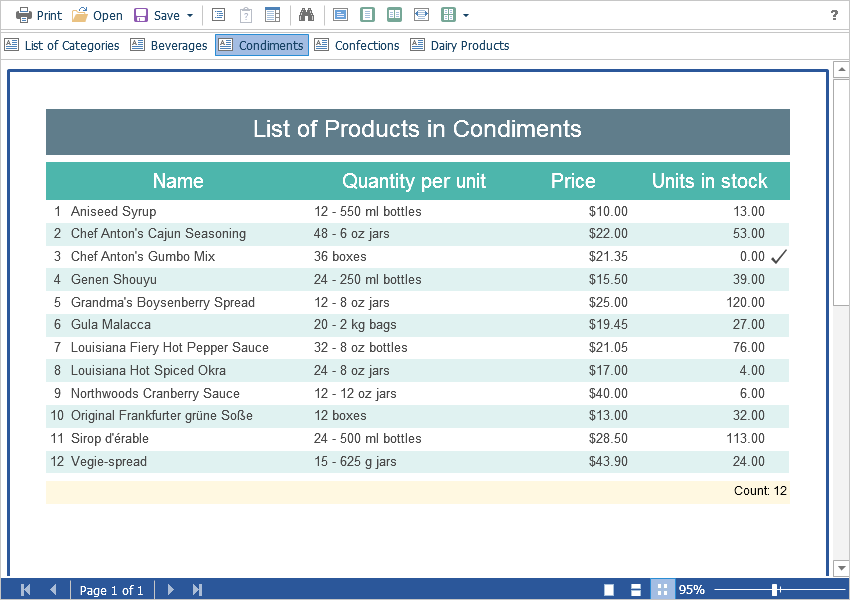

# Dynamic Sorting and Drill-Down

The **Flash Viewer** component supports the dynamic sorting and drill-down of reports. This feature does not require additional settings for the viewer. When you dynamically sort or use drill-down, the **GetReportSnapshot** action is called. In this action, the required report template should be loaded again. The necessary parameters transmitted from the client-side will be automatically applied to the report when the response is generated.


**Index.cshtml**

```
...
@Html.StiNetCoreViewerFx(new StiNetCoreViewerFxOptions() {
    Actions =
    {
        GetReport = "GetReport"
    }
})
...
```


**HomeController.cs**

```csharp
...
public IActionResult GetReport()
{
    StiReport report = new StiReport();
    report.Load(StiNetCoreHelper.MapPath(this, "Reports/ReportWithParameters.mrt"));
    
    return StiNetCoreViewerFx.GetReportResult(this, report);
}
...
```

Dynamic sorting provides the ability to change the direction of sorting in a rendered report. To do this, click on the component that has the dynamic sorting enabled. Dynamic sorting is carried out in the following directions - **Ascending** and **Descending**. Each time the component is clicked, the direction is reversed.


Multi-level sorting is allowed in the report. To do this, hold down the **Ctrl** key and sequentially click on the sorted components in the report. To reset sorting, you can click on any sorted component without holding down the **Ctrl** key.




When using drill-down, under the main panel of the viewer, the drill-down panel with tabs for detailed reports will be displayed. The currently displayed report will be highlighted.



