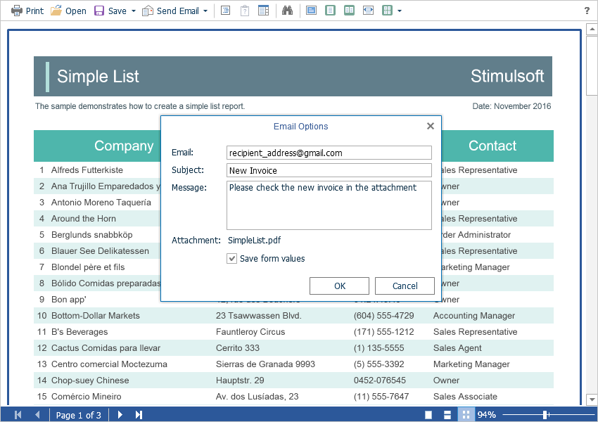

# Sending Report by Email

The **Flash Viewer** component provides the ability to send reports by email. To activate this feature, you should set the **ShowSendEmailButton** property of the viewer to **true**, and define the **EmailReport** event handler.


**Index.cshtml**

```
...
@Html.StiNetCoreViewerFx(new StiNetCoreViewerFxOptions() {
    Actions =
    {
        EmailReport = "EmailReport"
    },
    Toolbar =
    {
        ShowSendEmailButton = true
    }
})
...
```


**HomeController.cs**

```csharp
...
public IActionResult EmailReport()
{
    StiEmailOptions options = StiNetCoreViewerFx.GetEmailOptions(this);
    
    // Passed from the viewer, can be checked and changed
    // options.AddressTo = "";
    // options.Subject = "";
    // options.Body = "";
    
    // Should be filled here
    options.AddressFrom = "admin_address@test.com";
    options.Host = "smtp.test.com";
    options.Port = 465;
    options.UserName = "admin_address@test.com";
    options.Password = "admin_password";
    
    // options.CC.Add("email@test.com");
    // options.BCC.Add("email@test.com");
    // options.EnableSsl = true;
    
    return StiNetCoreViewerFx.EmailReportResult(this, options);
}
...
```

When you send a report by email the menu to select the attachment format is displayed. This matches the menu to select an export format. After choosing the format, the dialog to put send email parameters such as email recipient, subject and message, will be shown.




After confirmation of sending the email the above described **EmailReport** event will be called. You can check and correct the data entered in this form. The exported report file will be attached to the email automatically.


The **Flash Viewer** component allows you to set the recipient's email address, which will be used by default. The **DefaultEmailAddress** property is intended for this purpose.


**Index.cshtml**

```
...
@Html.StiNetCoreViewerFx(new StiNetCoreViewerFxOptions() {
    Email =
    {
        DefaultEmailAddress = "recipient_address@gmail.com"
    }
})
...
```
