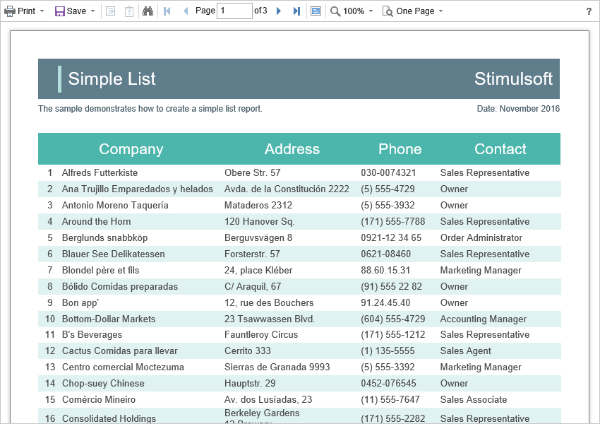

# Showing Reports and Dashboards

> **Information**
>
> Since dashboards and reports use the same unified template format - MRT, methods for loading the template and working with data, the word “report” will be used in the documentation text.


> **Notice**
>
> When a report is assigned to a viewer component, it is automatically generated. You only need to call the `Report.Render()` method if you want to perform specific actions with the rendered report before it is displayed in the viewer. Likewise, when using the compilation mode, you need to call the `Report.Compile()` method only if you have actions to perform with the compiled report before it is built and shown in the viewer.

To show the report, you need to add the **StiNetCoreViewer** component to the page and set it to the minimum required properties, and, in the view controller, specify the necessary actions.


**Index.cshtml**

```
...
@Html.StiNetCoreViewer(new StiNetCoreViewerOptions() {
    Actions =
    {
        GetReport = "GetReport",
        ViewerEvent = "ViewerEvent"
    }
})
...
```


**HomeController.cs**

```csharp
...
public IActionResult GetReport()
{
    StiReport report = new StiReport();
    report.Load(StiNetCoreHelper.MapPath(this, "Reports/SimpleList.mrt"));
    //report.Load(StiNetCoreHelper.MapPath(this, "Reports/Dashboard.mrt"));
    
    return StiNetCoreViewer.GetReportResult(this, report);
}

public IActionResult ViewerEvent()
{
    return StiNetCoreViewer.ViewerEventResult(this);
}
...
```

In the above example, the processing of two actions of the viewer is added. The **GetReport** action returns the report prepared for preview. The **ViewerEvent** action handles the viewer events.


> **Information**
>
> The **ViewerEvent** action is mandatory. Without it, the correct operation of the viewer is not possible.




If the report was not rendered before showing, the **HTML5 Viewer** component will automatically render it. So you can use report templates and rendered reports to display reports.


**HomeController.cs**

```csharp
...
public IActionResult GetReport()
{
    StiReport report = new StiReport();
    report.LoadDocument(StiNetCoreHelper.MapPath(this, "Reports/SimpleList.mdc"));
    
    return StiNetCoreViewer.GetReportResult(this, report);
}
...
```

Since the dashboard is not a static document and requires data to work, the format of the rendered MDC document is not available for it. Instead, it is possible to use a snapshot of the report in the MRT format, which contains all the data necessary for the dashboard to work and be correctly displayed in the viewer.


**HomeController.cs**

```csharp
...
public ActionResult GetReport()
{
    StiReport report = new StiReport();
    report.Load(StiNetCoreHelper.MapPath("~/Reports/Snapshot.mrt"));
    
    return StiNetCoreViewer.GetReportResult(report);
}
...
```

### Loading custom fonts

You can load custom fonts using the **StiFontCollection** class, having specified the file that contains a font. To do this, you should call the static method in the controller constructor to load a font.


**ViewerController.cs**

```csharp
...
public class ViewerController : Controller
{
    static ViewerController()
    {
        Stimulsoft.Base.StiFontCollection.AddFontFile(StiNetCoreHelper.MapPath(this, "/fonts/my-font/font-name.ttf"));
    }
}
...
```
