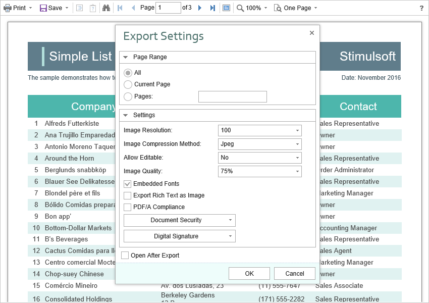

# Exporting Reports and Dashboards

> **Information**
>
> Since dashboards and reports use the same unified template format - MRT, methods for loading the template and working with data, the word “report” will be used in the documentation text.

The **HTML5 Viewer** component allows you to export the displayed report to three dozen various formats, such as **PDF**, **HTML**, **Word**, **Excel**, **XPS**, **RTF**, **images**, **text**, and others. You may export the dashboard to PDF, Excel, image files.




The export function does not require additional settings for the viewer. If you need to perform any actions before exporting the report, you can define a special **ExportReport** action.


**Index.cshtml**

```
...
@Html.StiNetCoreViewer(new StiNetCoreViewerOptions() {
    Actions =
    {
        ExportReport = "ExportReport"
    }
})
...
```


**Index.cshtml.cs**

```csharp
...
public IActionResult OnPostExportReport()
{
    // Some code before export
    // ...
    
    return StiNetCoreViewer.ExportReportResult(this);
}
...
```

### Export settings

Each report export format of the **HTML5 Viewer** component has a lot of settings, and each setting has its default values. Sometimes you need to set other default values. For this purpose, a special **DefaultSettings** property of the viewer is used. It is a container for all the default export settings.


**Index.cshtml**

```
...
@Html.StiNetCoreViewer(new StiNetCoreViewerOptions() {
    Exports =
    {
        DefaultSettings =
        {
            ExportToPdf =
            {
                ImageQuality = 0.75f,
                ImageFormat = Stimulsoft.Report.Export.StiImageFormat.Color
            },
            ExportToHtml =
            {
                ExportMode = Stimulsoft.Report.Export.StiHtmlExportMode.Div,
                UseEmbeddedImages = true
            }
        }
    }
})
...
```

If it is required, you can completely hide export dialogs. Exporting will always be done with default settings. For this, it is enough to set the value of the **ShowExportDialog** property to **false**.


**Index.cshtml**

```
...
@Html.StiNetCoreViewer(new StiNetCoreViewerOptions() {
    Exports =
    {
        ShowExportDialog = false
    }
})
...
```

The **HTML5 Viewer** component contains 30+ export formats, and sometimes you need to disable unwanted formats. This allows you to simplify UI and the use of the viewer. To disable unused export formats, it is enough to set the values for the corresponding properties of the viewer listed in the list below to **false**.


**Index.cshtml**

```
...
@Html.StiNetCoreViewer(new StiNetCoreViewerOptions() {
    Exports =
    {
        ShowExportToDocument = true,
        ShowExportToPdf = true,
        ShowExportToXps = true,
        ShowExportToPowerPoint = true,
        ShowExportToHtml = true,
        ShowExportToHtml5 = true,
        ShowExportToMht = true,
        ShowExportToText = true,
        ShowExportToRtf = true,
        ShowExportToWord2007 = true,
        ShowExportToOpenDocumentWriter = true,
        ShowExportToExcel = true,
        ShowExportToExcelXml = true,
        ShowExportToExcel2007 = true,
        ShowExportToOpenDocumentCalc = true,
        ShowExportToCsv = true,
        ShowExportToDbf = true,
        ShowExportToXml = true,
        ShowExportToDif = true,
        ShowExportToSylk = true,
        ShowExportToImageBmp = true,
        ShowExportToImageGif = true,
        ShowExportToImageJpeg = true,
        ShowExportToImagePcx = true,
        ShowExportToImagePng = true,
        ShowExportToImageTiff = true,
        ShowExportToImageMetafile = true,
        ShowExportToImageSvg = true,
        ShowExportToImageSvgz = true
    }
})
...
```

The **HTML5 Viewer** component can completely disable the export menu. To do this, set the value of the **ShowSaveButton** property to **false**.


**Index.cshtml**

```
...
@Html.StiNetCoreViewer(new StiNetCoreViewerOptions() {
    Toolbar =
    {
        ShowSaveButton = false
    }
})
...
```
