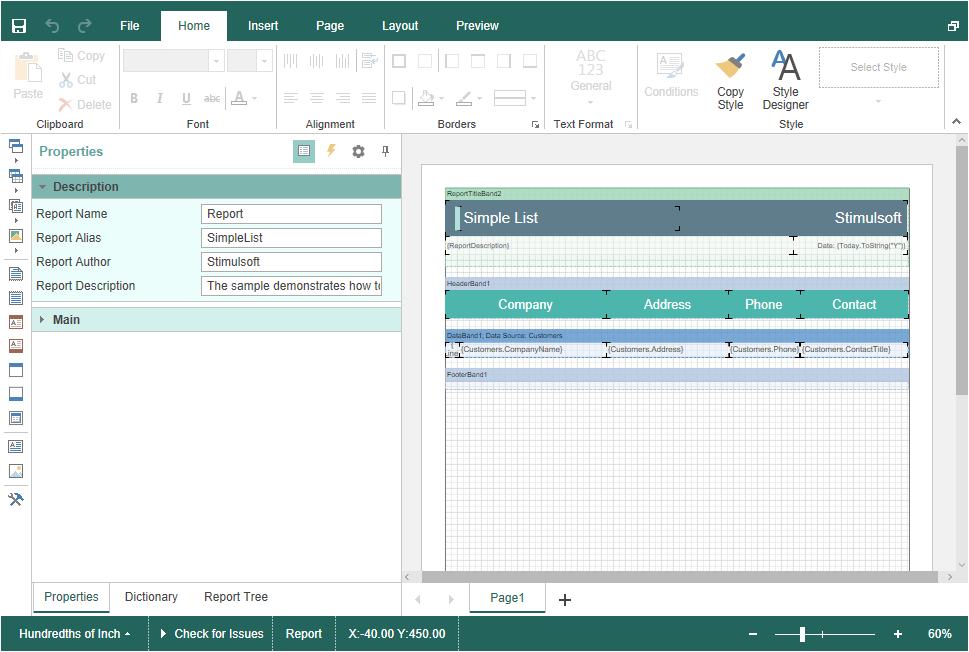

# Editing Reports and Dashboards

> **Information**
>
> Since dashboards and reports use the same unified template format - MRT, methods for loading the template and working with data, the word “report” will be used in the documentation text.

To edit a report template, you need to add the **StiMvcDesigner** component to the page, specify the minimum necessary settings, and define the actions required in the view controller.


**Index.cshtml**

```
...
@Html.Stimulsoft().StiMvcDesigner("MvcDesigner1", 
    new StiMvcDesignerOptions() {
        Actions =
        {
            GetReport = "GetReport",
            DesignerEvent = "DesignerEvent"
        }
})
...
```


**HomeController.cs**

```csharp
...
public ActionResult GetReport()
{
    StiReport report = new StiReport();
    report.Load(Server.MapPath("~/Content/SimpleList.mrt"));
    //report.Load(Server.MapPath("~/Content/Dashboard.mrt"));
    
    return StiMvcDesigner.GetReportResult(report);
}

public ActionResult DesignerEvent()
{
    return StiMvcDesigner.DesignerEventResult();
}
...
```




The **GetReport** action is used to load an editable report template. It is called automatically after the report designer is loaded. The **DesignerEvent** action is designed to process various additional designer actions, such as working with data and components, previewing reports, and others.


> **Information**
>
> The **DesignerEvent** action is mandatory. Without it, the correct work of the designer is impossible.
