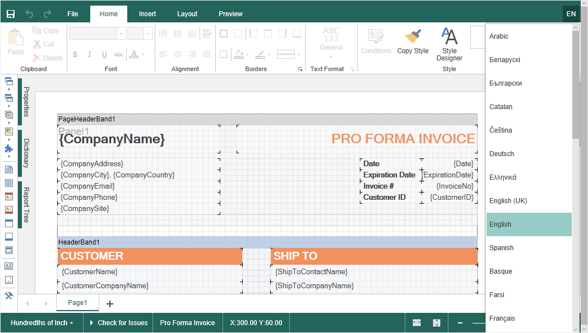

# Localization

The **HTML5 Designer** component supports the complete localization of its interface. Use the special **Localization** property to localize the report designer interface. As a value of this property, you should specify the path to the localization XML file (relative or absolute).


**Index.cshtml**

```
...
@Html.Stimulsoft().StiMvcDesigner("MvcDesigner1",
    new StiMvcDesignerOptions() {
        Localization = "~/Content/Localization/en.xml"
})
...
```

The interface of the report designer allows you to select the necessary localization from an access list. To do this, set value for the **LocalizationDirectory** property as the folder in which the localization XML files are stored.


**Index.cshtml**

```
...
@Html.Stimulsoft().StiMvcDesigner("MvcDesigner1",
    new StiMvcDesignerOptions() {
        Localization = "~/Content/Localization/en.xml",
        LocalizationDirectory = "~/Content/Localization"
})
...
```





> **Information**
>
> If the value for the **Localization** property is set, then when you run the report designer, the localization specified in this property will always be applied. If the property value is not set, the localization selected from the list of available localizations in the report designer panel will be automatically loaded.
