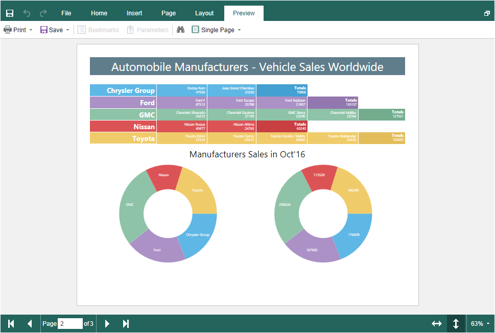

# Preview

> **Information**
>
> Since dashboards and reports use the same unified template format - MRT, methods for loading the template and working with data, the word “report” will be used in the documentation text.

The **HTML5 Designer** component provides the ability to preview reports. To preview the report, just go to the appropriate tab in the designer window. The report template will be transferred to the server-side, rendered, and displayed in the embedded viewer.




Before previewing the report, it is possible to perform any necessary actions, for example, connect data for the report. To do this, you can use the particular PreviewReport action that will be called before previewing the report. The **PreviewReport** action is called before preparing and rendering a report for viewing until it saves the cash.


**Index.cshtml**

```
...
@Html.Stimulsoft().StiMvcDesigner("MvcDesigner1", 
    new StiMvcDesignerOptions() {
        Actions =
        {
            PreviewReport = "PreviewReport"
        }
})
...
```


**HomeController.cs**

```csharp
...
public ActionResult PreviewReport()
{
    StiReport report = StiMvcDesigner.GetActionReportObject();
    //var Dashboard = StiMvcDesigner.GetActionReportObject();
    
    DataSet data = new DataSet("Demo");
    data.ReadXml(Server.MapPath("~/Content/Data/Demo.xml"));
    report.RegData(data);
    //Dashboard.RegData(data);
    
    return StiMvcDesigner.PreviewReportResult(report);
    //return StiMvcDesigner.PreviewReportResult(Dashboard);
}
...
```

If you need to make actions on your report immediately before displaying the report, you can use the **GetPreviewReport** action, which is called after the request of the prepared report from the cash.


**Index.cshtml**

```
...
@Html.Stimulsoft().StiMvcDesigner("MvcDesigner1", 
    new StiMvcDesignerOptions() {
        Actions =
        {
            GetPreviewReport = "GetPreviewReport"
        }
})
...
```


**HomeController.cs**

```csharp
...
public ActionResult GetPreviewReport()
{
    StiReport report = StiMvcDesigner.GetActionReportObject();
    //var Dashboard = StiMvcDesigner.GetActionReportObject();
    
    DataSet data = new DataSet("Demo");
    data.ReadXml(Server.MapPath("~/Content/Data/Demo.xml"));
    report.RegData(data);
    //Dashboard.RegData(data);
    //report.IsRendered = false;
    
    return StiMvcDesigner.PreviewReportResult(report);
    //return StiMvcDesigner.PreviewReportResult(Dashboard);
}
...
```


> **Information**
>
> So as in this event, a prepared report for viewing is transferred. If you need to render again, you should set the **report.IsRendered = false** flag.
