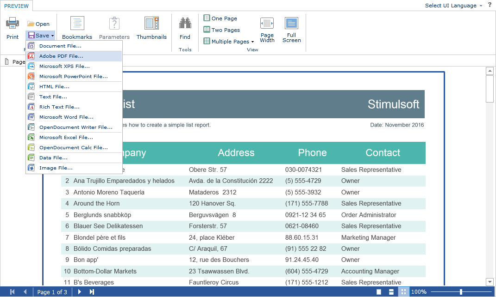

# Additional Features of Preview

The preview window of the **Flash Designer** component is a fully functional interactive **Flash Viewer** that can print and export reports, supports working with report parameters, interactive reports and sending them via email. To use these features, you do not need any additional settings for the report designer. The actions below are required for proper working with the embedded report viewer.


**Index.cshtml**

```
...
@Html.Stimulsoft().StiMvcDesignerFx("MvcDesignerFx1", 
    new StiMvcDesignerFxOptions() {
        Actions =
        {
            ExportReport = "ExportReport",
            EmailReport = "EmailReport"
        },
        PreviewToolbar =
        {
            ShowSendEmailButton = true
        }
})
...
```


**HomeController.cs**

```csharp
...
public ActionResult ExportReport()
{
    StiReport report = StiMvcDesignerFx.GetReportObject();
    // ...
    
    return StiMvcDesignerFx.ExportReportResult(report);
}

public ActionResult EmailReport()
{
    StiEmailOptions options = StiMvcViewerFx.GetEmailOptions();
    
    // Passed from the viewer, can be checked and changed
    // options.AddressTo = "";
    // options.Subject = "";
    // options.Body = "";
    
    // Should be filled here
    options.AddressFrom = "admin_address@test.com";
    options.Host = "smtp.test.com";
    options.Port = 465;
    options.UserName = "admin_address@test.com";
    options.Password = "admin_password";
    
    // options.CC.Add("email@test.com");
    // options.BCC.Add("email@test.com");
    // options.EnableSsl = true;
    
    return StiMvcDesignerFx.EmailReportResult(options);
}
...
```




In any of the above actions, you can manipulate the report template, for example, change its properties and parameters, connect new data for rendering.


> **Information**
>
> If exporting a report or sending an email with the report is not required, it is allowed not to set the specified actions. In this case, the corresponding menus in the embedded report viewer will be hidden.
