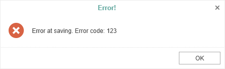
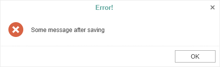

# Saving Reports and Dashboards

> **Information**
>
> Since dashboards and reports use the same unified template format - MRT, methods for loading the template and working with data, the word “report” will be used in the documentation text.

**The** **HTML5 Designer** **component provides two ways of saving the report, which are available in the main menu and the main panel of the designer -** **Save Report** **and** **Save As****. In turn, each of these ways has its modes and settings.**


**Saving a report and dashboard on the server-side**


To save the edited report on the server-side, you need to set the **OnSaveReport** special event, which will be called when you select the **Save Report** menu item or click the Save button on the main panel of the designer.


**Default.aspx**

```
...
<cc1:StiWebDesigner ID="StiWebDesigner1" runat="server"
    OnSaveReport="StiWebDesigner1_SaveReport">
</cc1:StiWebDesigner>
...
```


**Default.aspx.cs**

```csharp
...
protected void StiWebDesigner1_SaveReport(object sender, StiReportDataEventArgs e)
{
    StiReport report = e.Report;
        
    // Save the report template
    // ...
}
...
```

By default, after saving the report, the designer continues working without displaying any messages. If necessary, after saving the report, it is possible to display a dialog box with an error or a text message. For this purpose, the special properties - **e.ErrorCode** and **e.ErrorString** in the arguments of the event are used.


**Default.aspx.cs**

```csharp
...
protected void StiWebDesigner1_SaveReport(object sender, StiReportDataEventArgs e)
{
    StiReport report = e.Report;
        
    // Save the report template
    // ...
    
    e.ErrorCode = 123;
    //e.ErrorString = "Some message after saving";
}
...
```

You can get a report name from the designer save dialog or an original report name.


**Default.aspx.cs**

```csharp
...
protected void StiWebDesigner1_SaveReport(object sender, StiSaveReportEventArgs e)
{
    //Report name from the designer save dialog
    var reportName = e.FileName;
    
    //Original report name from properties
    var reportName = e.Report.ReportName;
}
...
```

If you set a positive integer value for the **e.ErrorCode** property, the user will see the error message of saving the report and the error code, where the error code is the integer value.




If you set a string value for the **e.ErrorString** property, a dialog with the specified text will be displayed. The text can contain both a save error message or a warning, or any other message.





### Saving reports and dashboards on the client side

To save the edited report on the client-side as a file, no additional designer settings are required. It is enough to click the **Save As** main menu item. The dialog box will be displayed. In this dialog, you can change the name of the report file. The file will be saved to the local disk of the computer.


The **HTML5 Designer** component provides the ability to change the behavior of the specified save option. For this purpose, the special **OnSaveReportAs** event is used in the designer. If you use this event, the report will be saved on the server-side. The work of this event will be similar to the **OnSaveReport** event.


**Default.aspx**

```
...
<cc1:StiWebDesigner ID="StiWebDesigner1" runat="server"
    OnSaveReportAs="StiWebDesigner1_SaveReportAs">
</cc1:StiWebDesigner>
...
```


**Default.aspx.cs**

```csharp
...
protected void StiWebDesigner1_SaveReportAs(object sender, StiReportDataEventArgs e)
{
    StiReport report = e.Report;
        
    // Save the report template
    // ...
}
...
```


### Saving settings

The report is saved in the background mode without reloading the page in the web browser window. Suppose you need to control the process of saving the report visually. In that case, you should change the value of the **SaveReportMode** (or **SaveReportAsMode**) property of the designer to one of the three specified values - **Hidden** (default value), **Visible**, or **NewWindow**.


**Default.aspx**

```
...
<cc1:StiWebDesigner ID="StiWebDesigner1" runat="server"
    OnSaveReportAs="StiWebDesigner1_SaveReportAs"
    SaveReportAsMode="Visible">
</cc1:StiWebDesigner>
...
```

If the **SaveReportMode** property is set to **Visible**, the report save event will be called in the current browser window in the normal (visible) mode using the POST request. If the **SaveReportMode** property is set to **NewWindow**, the report save event will be called in a new window of the web browser. By default, this property is set to **Hidden** - the report save event is called in the background using the AJAX request and is not displayed in the browser window. The same values and behavior are applicable to the **SaveReportAsMode** property.
