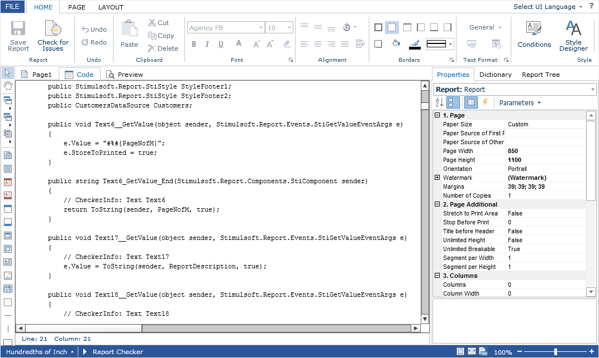

# Additional Features of Designer

In addition to the basic editing and previewing capabilities of the report, **Flash Designer** has several additional features.


It is possible to view the C#/VB.Net code of an editable report template in a separate designer tab. By default, it is disabled. To enable it, you should set the **ShowCodeTab** property to **true**.


**Default.aspx**

```
...
<cc1:StiWebDesignerFx ID="StiWebDesignerFx1" runat="server"
    ShowCodeTab="true">
</cc1:StiWebDesignerFx>
...
```





> **Information**
>
> If any errors occurred during the compilation of the report, they will be displayed as a list in a separate dialog box. When double-click on the selected compilation error, a C#/VB.Net code window will be shown. The cursor will be moved to the place where this error occurred.

The main menu of the **Flash Designer** component contains the **Exit** item, when selected, a special **OnExit** event is called, and if it is not present, go to the address specified in the URL settings.


**Default.aspx**

```
...
<cc1:StiWebDesignerFx ID="StiWebDesignerFx1" runat="server"
    OnExit="StiWebDesignerFx1_Exit">
</cc1:StiWebDesignerFx>
...
```


**Default.aspx.cs**

```csharp
...
protected void StiWebDesignerFx1_Exit(object sender, StiReportDataEventArgs e)
{
    this.Response.Redirect("Home.aspx");
}
...
```

In the **OnExit** event of the designer, you implement transferring to the required page. Also, instead of using an event, you can specify a URL address using the **ExitUrl** property.


**Default.aspx**

```
...
<cc1:StiWebDesignerFx ID="StiWebDesignerFx1" runat="server"
    ExitUrl="http://www.stimulsoft.com">
</cc1:StiWebDesignerFx>
...
```
