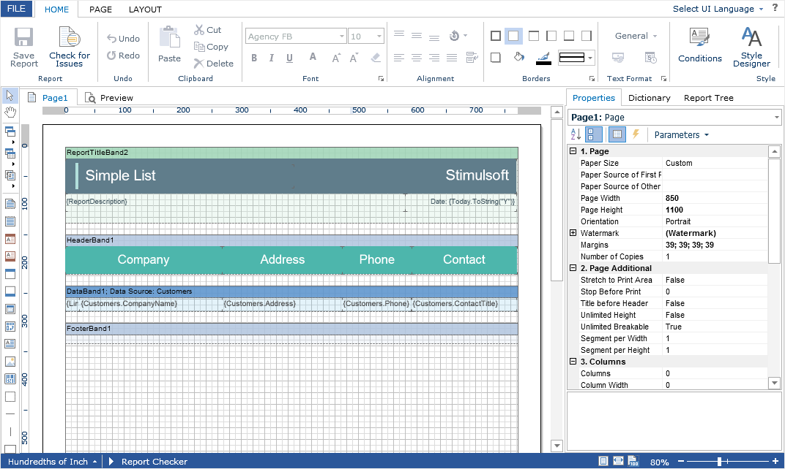

# Editing Reports

To edit a report template, you need to add the **StiWebDesignerFx** component to the ASPX page and assign a loaded report template to it.


**Default.aspx**

```
...
<cc1:StiWebDesignerFx ID="StiWebDesignerFx1" runat="server">
</cc1:StiWebDesignerFx>
...
```


**Default.aspx.cs**

```csharp
...
protected void Page_Load(object sender, EventArgs e)
{
    StiReport report = new StiReport();
    report.Load(Server.MapPath("Reports/SimpleList.mrt"));
        
    StiWebDesignerFx1.Report = report;
}
...
```




Also **Flash Designer** has a special **OnGetReport** event that you can use to assign a report template. In this case, you need to load the report in the event handler.


**Default.aspx**

```
...
<cc1:StiWebDesignerFx ID="StiWebDesignerFx1" runat="server"
    OnGetReport="StiWebDesignerFx1_GetReport">
</cc1:StiWebDesignerFx>
...
```


**Default.aspx.cs**

```csharp
...
protected void StiWebDesignerFx1_GetReport(object sender, StiReportDataEventArgs e)
{
    StiReport report = new StiReport();
    report.Load(Server.MapPath("Reports/SimpleList.mrt"));
    
    e.Report = report;
}
...
```


> **Information**
>
> The **OnGetReport** event will be called regardless of whether the report was previously assigned or not. If the report is already assigned to the designer, then, in the event arguments, the **e.Report** property will contain the loaded report object. You can change it or assign a new report.


By default, **Flash Designer** uses the entire area of the browser window to edit the report. To display a component in a specific HTML page with the specific position and dimensions, it is enough to set its width and height using the **Width** and **Height** properties.


**Default.aspx**

```
...
<cc1:StiWebDesignerFx ID="StiWebDesignerFx1" runat="server"
    Width="1000px" Height="800px">
</cc1:StiWebDesignerFx>
...
```

You can also use the special **Design()** method, which displays only the designer component on the ASPX page, ignoring all other Web components and page styles. As input arguments, this method takes a report object.


**Default.aspx.cs**

```csharp
...
protected void Page_Load(object sender, EventArgs e)
{
    StiReport report = new StiReport();
    report.Load(Server.MapPath("Reports/SimpleList.mrt"));
        
    StiWebDesignerFx1.Design(report);
}
...
```

If you do not specify a report in the **Design()** method, you can load it in the **OnGetReport** event after the designer is loaded.


**Default.aspx.cs**

```csharp
...
protected void Page_Load(object sender, EventArgs e)
{ 
    StiWebDesignerFx1.Design();
}

protected void StiWebDesignerFx1_GetReport(object sender, StiReportDataEventArgs e)
{
    StiReport report = new StiReport();
    report.Load(Server.MapPath("Reports/SimpleList.mrt"));
    
    e.Report = report;
}
...
```

If it is required to hide the designer by default, and display it on the page after calling the **Design()** method, you can use the **Visible** property - set it to **False**.


**Default.aspx**

```
...
<cc1:StiWebDesignerFx ID="StiWebDesignerFx1" runat="server"
    Visible="False">
</cc1:StiWebDesignerFx>
...
```
