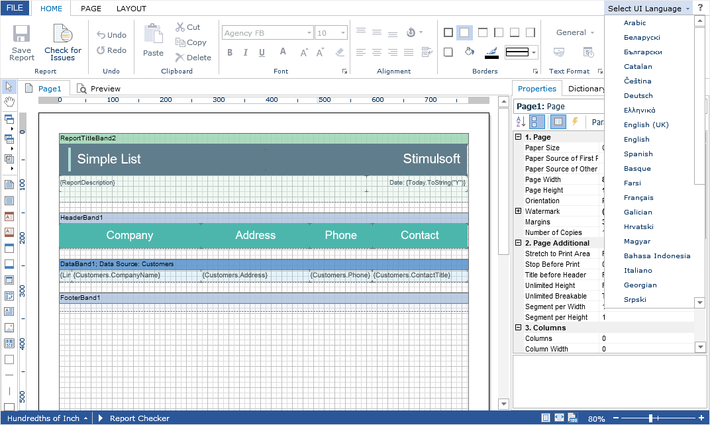

# Localization

The **Flash Designer** component supports the complete localization of its interface. Use the special **Localization** property to localize the report designer interface. As a value of this property you should specify the path to the localization XML file (relative or absolute).


**Default.aspx**

```
...
<cc1:StiWebDesignerFx ID="StiWebDesignerFx1" runat="server"
    Localization="Localization/en.xml">
</cc1:StiWebDesignerFx>
...
```

The interface of the report designer allows you to select the necessary localization from an accessible list. To do this, the value of the **LocalizationDirectory** property must the folder in which the localization XML files are stored.


**Default.aspx**

```
...
<cc1:StiWebDesignerFx ID="StiWebDesignerFx1" runat="server"
    Localization="Localization/en.xml"
    LocalizationDirectory="Localization">
</cc1:StiWebDesignerFx>
...
```





**Information**


If the value for the **Localization** property is set, then when you run the report designer, then the localization, specified in this property, will always be applied. If the property value is not set, then the localization, selected from the list of available localizations in the report designer panel, will be automatically loaded.
