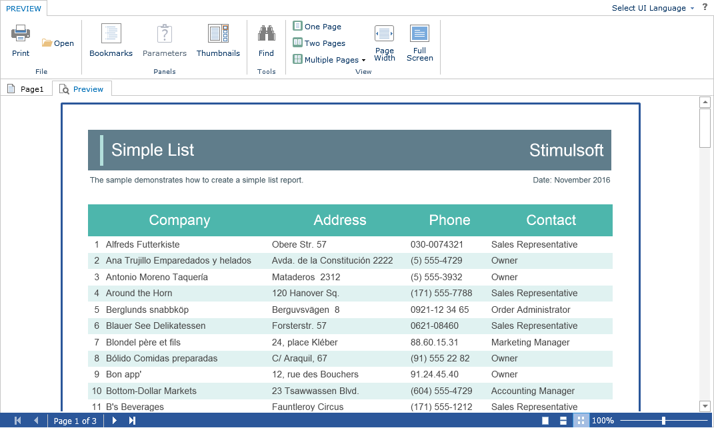

# Preview

The **Flash Designer** component provides the ability to preview reports. To preview the report, just go to the appropriate tab in the designer window. The report template will be transferred to the server-side, rendered and displayed in the embedded viewer.




Before previewing the report, it is possible to perform any necessary actions, for example, connect data for the report. To do this, you can use a special **OnPreviewReport** event which will be called before previewing the report. In the arguments of the event, there will be a report to be previewed.


**Default.aspx**

```
...
<cc1:StiWebDesignerFx ID="StiWebDesignerFx1" runat="server"
    OnPreviewReport="StiWebDesignerFx1_PreviewReport">
</cc1:StiWebDesignerFx>
...
```


**Default.aspx.cs**

```csharp
...
protected void StiWebDesignerFx1_PreviewReport(object sender, StiReportDataEventArgs e)
{
    DataSet data = new DataSet("Demo");
    data.ReadXml(Server.MapPath("Data/Demo.xml"));
    e.Report.RegData(data);
}
...
```
