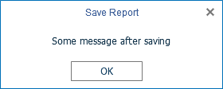

# Saving Reports

The **Flash Designer** component provides two ways of saving the report which are available in the main menu and in the main panel of the designer - **Save Report** and **Save As**. In turn, each of these ways has its own modes and settings.


### Saving reports on the server-side

To save the edited report on the server-side, you need to use the special **OnSaveReport** event, which will be called when you select the **Save Report** menu item, or click the **Save** button on the main panel of the report designer.


**Default.aspx**

```
...
<cc1:StiWebDesignerFx ID="StiWebDesignerFx1" runat="server"
    OnSaveReport="StiWebDesignerFx1_SaveReport">
</cc1:StiWebDesignerFx>
...
```


**Default.aspx.cs**

```csharp
...
protected void StiWebDesignerFx1_SaveReport(object sender, StiReportDataEventArgs e)
{
    StiReport report = e.Report;
        
    // Save the report template
    // ...
}
...
```

By default, after saving the report, the designer continues to work without displaying any messages. If necessary, it is possible to display a dialog box about successful saving, or arbitrary code and error text that occurred when saving. For this purpose special properties - **e.ErrorCode** and **e.ErrorString** - are provided. They are located in the arguments of the event.


**Default.aspx.cs**

```csharp
...
protected void StiWebDesignerFx1_SaveReport(object sender, StiReportDataEventArgs e)
{
    StiReport report = e.Report;
        
    // Save the report template
    // ...
    
    e.ErrorCode = 0;
    //e.ErrorCore = 123;
    //e.ErrorString = "Some message after saving";
}
...
```

If you set the **e.ErrorCode** property to **0**, the designer displays a window about the successful saving of the report.

If you set another integer value for the **e.ErrorCode** property, the user will receive a message indicating that the report was saved and an error code, where the error code is the specified integer value.

If you set a string value for the **e.ErrorString** property, a dialog box with the specified text will be displayed. The text can contain both a save error message or a warning, or any other message.




The **Flash Designer** component allows you to correct a report on the server-side while saving it. In order for the corrected report to be sent back to the client-side, you should set the **e.SendReportToClient** property to **true**. This property is located in the event arguments.


**Default.aspx.cs**

```csharp
...
protected void StiWebDesignerFx1_SaveReport(object sender, StiReportDataEventArgs e)
{
    StiReport report = e.Report;
    report.ReportAuthor = "Stimulsoft";
        
    // Save the report template
    // ...
    
    e.SendReportToClient = true;
}
...
```


### Saving reports on the client-side

No additional designer settings are required to save the edited report on the client-side as a file. It is enough to select the **Save As** menu item. When you click on it you will be asked to choose the format of saving the report. After the format is selected, the system save file dialog is displayed. In this dialog, you can specify the name of the report file and the folder in what to save.


The **Flash Designer** component provides the ability to change the behavior of the specified save option. For this purpose, the designer provides a special **OnSaveReportAs** event. If you use this event, the report will be saved on the server-side. This event will work similar to the **OnSaveReport** event.


**Default.aspx**

```
...
<cc1:StiWebDesignerFx ID="StiWebDesignerFx1" runat="server"
    OnSaveReportAs="StiWebDesignerFx1_SaveReportAs">
</cc1:StiWebDesignerFx>
...
```


**Default.aspx.cs**

```csharp
...
protected void StiWebDesignerFx1_SaveReportAs(object sender, StiReportDataEventArgs e)
{
    StiReport report = e.Report;
        
    // Save the report template
    // ...
}
...
```


### Saving settings

The report is saved in the background mode without reloading the page in the web browser window. If you need to visually control the process of saving the report, you should change the value of the **SaveReportMode** (or **SaveReportAsMode**) property of the designer to one of the three specified values - **Hidden** (default value), **Visible** or **NewWindow**.


**Default.aspx**

```
...
<cc1:StiWebDesignerFx ID="StiWebDesignerFx1" runat="server"
    OnSaveReportAs="StiWebDesignerFx1_SaveReportAs"
    SaveReportAsMode="Visible">
</cc1:StiWebDesignerFx>
...
```

If the **SaveReportMode** property is set to **Visible**, the report save event will be called in the current browser window in the normal (visible) mode using the POST request. If the **SaveReportMode** property is set to **NewWindow**, the report save event will be called in a new browser window. By default, this property is set to **Hidden** - the report save event is called in the background using the AJAX request and is not shown in the browser window. The same values and behavior are applicable to the **SaveReportAsMode** property.


Since the designer has the functionality to create a new report, then, when you save it, you may need to find out if the previously loaded report is saved or it is a new report. To do this, you can use the **e.IsNewReport** property, which is located in the arguments of the event.


**Default.aspx.cs**

```csharp
...
protected void StiWebDesignerFx1_SaveReport(object sender, StiReportDataEventArgs e)
{
    StiReport report = e.Report;
        
    if (e.IsNewReport)
    {
        // Save the new report
    }
    else
    {
        // Save the edited report
    }
}
...
```


> **Information**
>
> After saving a report first time, the report will no longer be considered as new and the specified property will have a negative value.

The **Flash Designer** component provides the ability to automatically save a report after a certain interval of time. To enable this option, set the value for the **AutoSaveInterval** property. It is specified in minutes. Through this specified interval, the designer will automatically initiate the **SaveReport** action to save reports. By default, the property has **0** value, i.e. the automatic saving of the report is disabled. In addition, in the report save event, you can find out whether the event was automatically triggered or triggered by clicking on the report save button. To do this, you can use the **e.IsAutoSave** property. It is located in the arguments of the event.


**Default.aspx**

```
...
<cc1:StiWebDesignerFx ID="StiWebDesignerFx1" runat="server"
    OnSaveReport="StiWebDesignerFx1_SaveReport"
    AutoSaveInterval="3">
</cc1:StiWebDesignerFx>
...
```


**Default.aspx.cs**

```csharp
...
protected void StiWebDesignerFx1_SaveReport(object sender, StiReportDataEventArgs e)
{
    StiReport report = e.Report;
        
    if (e.IsAutoSave)
    {
        // ...
    }
    
    // Save the report template
    // ...
}
...
```
