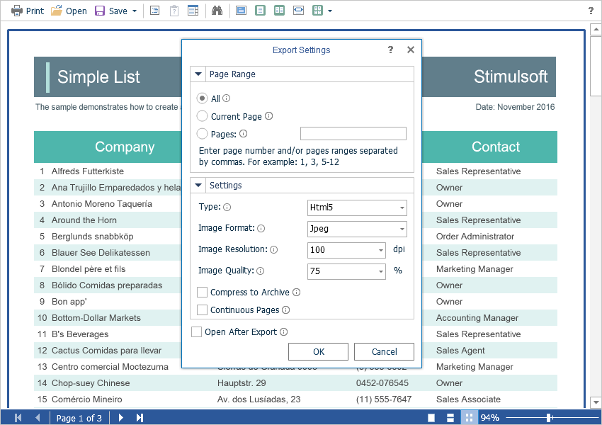

# Exporting Reports

The **Flash Viewer** component allows you to export the displayed report in three dozen of various formats, such as **PDF**, **HTML**, **Word**, **Excel**, **XPS**, **RTF**, images, text and others. Export functions do not require additional settings for the viewer.




### Export events

To perform any actions, a special **OnExportReport** event is assigned before the report is exported. In this event, you can get the type of the report export, get the report itself, and get the report export settings and, if necessary, change them.


**Default.aspx**

```
...
<cc1:StiWebViewerFx ID="StiWebViewerFx1" runat="server"
    OnExportReport="StiWebViewerFx1_ExportReport">
</cc1:StiWebViewerFx>
...
```


**Default.aspx.cs**

```csharp
...
protected void StiWebViewerFx1_ExportReport(object sender, StiExportReportEventArgs e)
{
    StiExportFormat format = e.Format;
    StiReport report = e.Report;
    StiExportSettings settings = e.Settings;
}
...
```

To perform any actions with an already exported report, the **OnExportReportResponse** event is used. This event will be called immediately before the file is saved. In this event, you can get the export format, the type of the Web content and the name of the file to save. You can also get, and, if necessary, change the byte stream of the final export file.


**Default.aspx**

```
...
<cc1:StiWebViewerFx ID="StiWebViewerFx1" runat="server"
    OnExportReportResponse="StiWebViewerFx1_ExportReportResponse">
</cc1:StiWebViewerFx>
...
```


**Default.aspx.cs**

```csharp
...
protected void StiWebViewerFx1_ExportReportResponse(object sender, StiExportReportResponseEventArgs e)
{
    StiExportFormat format = e.Format;
    string contentType = e.ContentType;
    string fileName = e.FileName;
    Stream stream = e.Stream;
}
...
```


### Export settings

The **Flash Viewer** component contains 30+ export formats, and sometimes you need to disable unwanted formats. This allows you to simplify UI and the use of the viewer. To disable unused export formats, it is enough to set the values for the corresponding properties of the viewer listed in the list below to **false**.


**Default.aspx**

```
...
<cc1:StiWebViewerFx ID="StiWebViewerFx1" runat="server"
    ShowExportToDocument="true"
    ShowExportToPdf="true"
    ShowExportToXps="true"
    ShowExportToPowerPoint="true"
    ShowExportToHtml="true"
    ShowExportToHtml5="true"
    ShowExportToMht="true"
    ShowExportToText="true"
    ShowExportToRtf="true"
    ShowExportToWord2007="true"
    ShowExportToOpenDocumentWriter="true"
    ShowExportToExcel="true"
    ShowExportToExcelXml="true"
    ShowExportToExcel2007="true"
    ShowExportToOpenDocumentCalc="true"
    ShowExportToCsv="true"
    ShowExportToDbf="true"
    ShowExportToXml="true"
    ShowExportToDif="true"
    ShowExportToSylk="true"
    ShowExportToImageBmp="true"
    ShowExportToImageGif="true"
    ShowExportToImageJpeg="true"
    ShowExportToImagePcx="true"
    ShowExportToImagePng="true"
    ShowExportToImageTiff="true"
    ShowExportToImageMetafile="true"
    ShowExportToImageSvg="true"
    ShowExportToImageSvgz="true">
</cc1:StiWebViewerFx>
...
```

Also, if required, you can completely hide export dialogs. Exporting will always be done with default settings. For this, it is enough to set the value of the **ShowExportDialog** property to **false**.


**Default.aspx**

```
...
<cc1:StiWebViewerFx ID="StiWebViewerFx1" runat="server"
    ShowExportDialog="false">
</cc1:StiWebViewerFx>
...
```

The **Flash Viewer** component can completely disable the export menu. To do this, set the value of the **ShowSaveButton** property to **false**.


**Default.aspx**

```
...
<cc1:StiWebViewerFx ID="StiWebViewerFx1" runat="server"
    ShowSaveButton="false">
</cc1:StiWebViewerFx>
...
```
