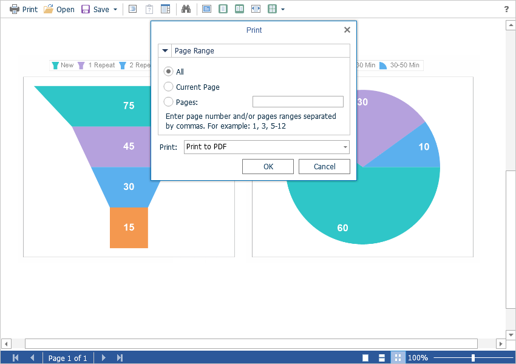

# Printing Reports

The **Flash Viewer** component provides several options for printing a report. Each has its own advantages and disadvantages.


### Default

The report will be printed directly from the Flash application using built-in printing methods. One of the advantages is the complete similarity of the report preview and printed report, since a graphical snapshot of the report page is sent to the printer. The disadvantages include the large amount of information sent to the printer. Also, small text may look a little blurry. This happens because printing in Flash is done by converting the report page into an image.


### Print as PDF

Printing will be done by exporting the report to the **PDF format**. The advantages are greater accuracy of positioning and printing of the report elements in comparison with other printing options. Among the drawbacks, one can mention the mandatory presence of a plug-in installed in a web browser for viewing PDF files (modern browsers have embedded PDF viewer and printer).


### Print as HTML

The report will be printed by exporting the report to the **HTML format**. Advantages - cross-browser compatibility when printing, no need to install special plug-ins. The disadvantage is the relatively low accuracy of the position of the report elements, due to the peculiarities of the implementation of HTML formatting.


> **Information**
>
> When printing to the **HTML format**, you should check the compliance of report page settings and printer parameters (paper size, orientation, margins, indents), as well as check your browser print settings, such as margins, headers, footers, watermarks printing, color printing.




### Report printing events

To perform any actions, a special **OnPrintReport** event is assigned before the report is printed. In this event, you can get the report itself, and also get the export report settings to the **PDF format**.


**Default.aspx**

```
...
<cc1:StiWebViewerFx ID="StiWebViewerFx1" runat="server"
    OnPrintReport="StiWebViewerFx1_PrintReport">
</cc1:StiWebViewerFx>
...
```


**Default.aspx.cs**

```csharp
...
protected void StiWebViewerFx1_PrintReport(object sender, StiPrintReportEventArgs e)
{
    StiReport report = e.Report;
    StiExportSettings settings = e.Settings;
}
...
```


> **Information**
>
> The specified event will only be triggered when printing to the **PDF format**. This happens because the rest of the printing modes are processed only on the client-side (in the Flash application) and do not require any requests to the server-side.


### Reports setup

If you choose to print a report on the viewer panel, a print dialog with a selection of pages and a print type is displayed. The **Flash Viewer** component has the ability to hide unwanted printing modes. For this, it is enough to set the value to **false** for the corresponding properties of the viewer.


**Default.aspx**

```
...
<cc1:StiWebViewerFx ID="StiWebViewerFx1" runat="server"
    AllowDefaultPrint="false"
    AllowPrintToHtml="false"
    AllowPrintToPdf="true">
</cc1:StiWebViewerFx>
...
```

The **Flash Viewer** component has the ability to disable the built-in report printing dialog. By clicking on the button, the system print dialog will be displayed immediately, the report will be printed in the **Default** mode. To do this, set the value for the **ShowPrintDialog** property to **false**.


**Default.aspx**

```
...
<cc1:StiWebViewerFx ID="StiWebViewerFx1" runat="server"
    ShowPrintDialog="false">
</cc1:StiWebViewerFx>
...
```

Also, the **Flash Viewer** component has the ability to completely disable report printing. To do this, set the value of the **ShowPrintButton** property to **false**.


**Default.aspx**

```
...
<cc1:StiWebViewerFx ID="StiWebViewerFx1" runat="server"
    ShowPrintButton="false">
</cc1:StiWebViewerFx>
...
```

When printing in **Default** mode, the **Flash Viewer** component allows you to configure advanced print settings. For this purpose, several properties are shown below.


**Default.aspx**

```
...
<cc1:StiWebViewerFx ID="StiWebViewerFx1" runat="server"
    AutoPageOrientation="true"
    AutoPageScale="true"
    PrintAsBitmap="true">
</cc1:StiWebViewerFx>
...
```

The **AutoPageOrientation** property enables the automatic report page rotation, if the page orientation does not match the page orientation settings of the printer. By default, the property is set to **true**.


The **AutoPageScale** property enables the report page zoom to be automatically adjusted to the paper size. This allows you to get rid of unnecessary fields and indentation, but it can lead to violation of proportions of some components of the report. This mode is suitable for most common reports. By default, the property is set to **true**.


The **PrintAsBitmap** property enables the report printing mode by means of a snapshot of the report page. When the mode is enabled, the report will be printed as is, as accurately as possible, with all styles and images. If the property is set to **false**, the vector print mode will be enabled, but due to the printing feature in Flash, only text and some graphical elements of the report in black and white mode will be printed. By default, the property is set to **true**.
