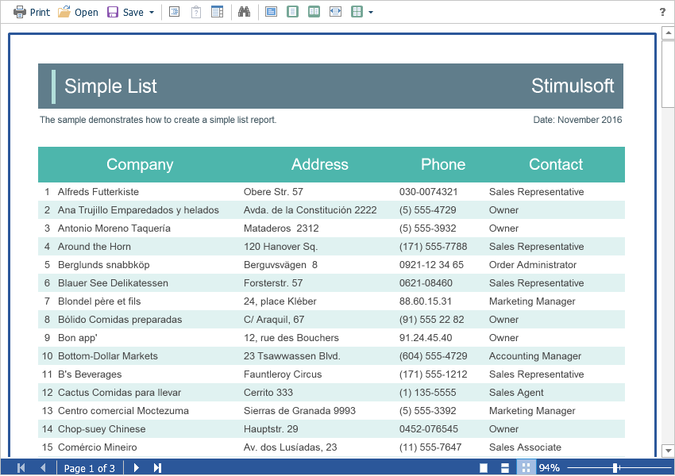

# Showing Reports

To show a report, you need to add the **StiWebViewerFx** component to the ASPX page and assign a loaded report to it.


**Default.aspx**

```
...
<cc1:StiWebViewerFx ID="StiWebViewerFx1" runat="server">
</cc1:StiWebViewerFx>
...
```


**Default.aspx.cs**

```csharp
...
protected void Page_Load(object sender, EventArgs e)
{
    StiReport report = new StiReport();
    report.Load(Server.MapPath("Reports/SimpleList.mrt"));
        
    StiWebViewerFx1.Report = report;
}
...
```




Also, the **Flash Viewer** has a special **OnGetReport** event that you can use to assign a report to the viewer. In this case, you need to load the report in the event handler.


**Default.aspx**

```
...
<cc1:StiWebViewerFx ID="StiWebViewerFx1" runat="server"
    OnGetReport="StiWebViewerFx1_GetReport">
</cc1:StiWebViewerFx>
...
```


**Default.aspx.cs**

```csharp
...
protected void StiWebViewerFx1_GetReport(object sender, StiReportDataEventArgs e)
{
    StiReport report = new StiReport();
    report.Load(Server.MapPath("Reports/SimpleList.mrt"));
    
    e.Report = report;
}
...
```


> **Information**
>
> To assign a report, it is preferable to use the specified **OnGetReport** event, because in this case, if you need to load a report, for example, for interactive actions of the viewer, or to view and export the report without using caching, the specified event will be called and the report preview will be continued.

If the report was not rendered before showing, the **Flash Viewer** component will automatically render it. So, you can use various types of reports to display the report - report templates, rendered reports, and reports as classes.


**Default.aspx.cs**

```csharp
...
protected void StiWebViewerFx1_GetReport(object sender, StiReportDataEventArgs e)
{
    StiReport report = new StiReport();
    report.LoadDocument(Server.MapPath("Reports/SimpleList.mdc"));
    
    e.Report = report;
}
...
```


**Default.aspx.cs**

```csharp
...
protected void StiWebViewerFx1_GetReport(object sender, StiReportDataEventArgs e)
{
e.Report = new StiReportCompiledClass();
}
...
```

The **Flash Viewer** component is able to display the report in the entire accessible space of the browser window, regardless of whether other HTML elements are present on the Web page. For this purpose, a special **View()** method is used. As arguments, the method takes a report object.


**Default.aspx.cs**

```csharp
...
protected void Page_Load(object sender, EventArgs e)
{
    StiReport report = new StiReport();
    report.Load(Server.MapPath("Reports/SimpleList.mrt"));
    
    StiWebViewerFx1.View(report);
}
...
```

To display the viewer to the entire space of the browser window when you use the **OnGetReport** event to load a report, you should call the **View()** method without specifying the report object.


**Default.aspx.cs**

```csharp
...
protected void Page_Load(object sender, EventArgs e)
{ 
    StiWebViewerFx1.View();
}

protected void StiWebViewerFx1_GetReport(object sender, StiReportDataEventArgs e)
{
    StiReport report = new StiReport();
    report.Load(Server.MapPath("Reports/SimpleList.mrt"));
    
    e.Report = report;
}
...
```
