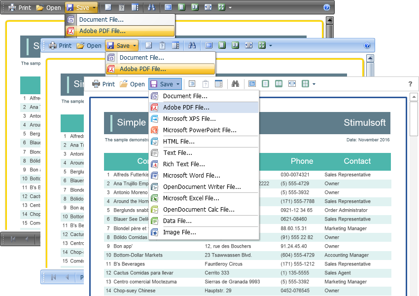

# Using Themes

The **Flash Viewer** component can change the appearance of visual controls. To change the theme, use the **Theme** property.


**Default.aspx**

```
...
<cc1:StiWebViewerFx ID="StiWebViewerFx1" runat="server"
    Theme="Office2022">
</cc1:StiWebViewerFx>
...
```

Currently, **4 themes** are available.



