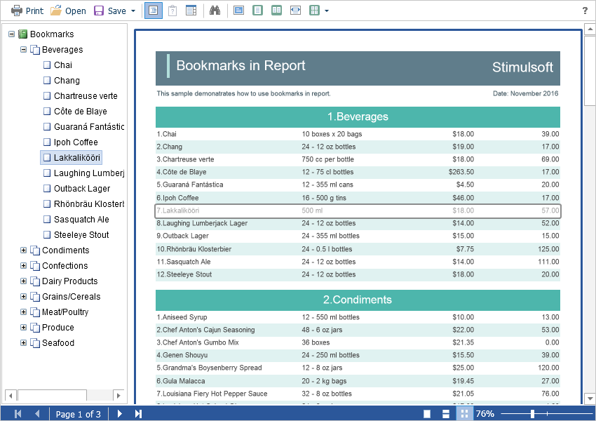

# Work with Bookmarks

The **Flash Viewer** component supports report bookmarks. When displaying such a report on the left side of the page, a panel with bookmarks will be displayed. When you select a bookmark of the report, the viewer will carry out an automatic transition to the specified page, and the report item with a bookmark is highlighted.




If you do not need to work with report bookmarks, you can completely disable this feature. For this purpose, the **ShowBookmarksButton** property is used. It should be set to **false**.


**Default.aspx**

```
...
<cc1:StiWebViewerFx ID="StiWebViewerFx1" runat="server"
    ShowBookmarksButton="false">
</cc1:StiWebViewerFx>
...
```


> **Information**
>
> In this case, report bookmarks will not be displayed, even if they are present in the displayed report. This property has no effect on printing and exporting reports.
