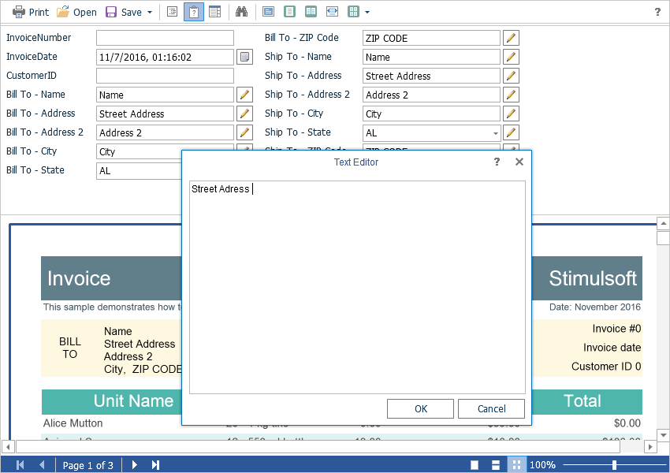

# Work with Parameters

To work with report parameters in the **Flash Viewer**, there is a special settings panel. To add a parameter to the panel you need to define a variable in a report, requested by the user. When viewing a report in the viewer such a variable will be automatically added to the settings panel. It supports all types of report variables (normal variables, date and time, borders, lists, etc.).




To perform any action before applying parameters, there is a special **OnInteraction** event that will be called when there are some interactive activities in the viewer. When you use the options panel, the type of action will have the **Variables** value.


**Default.aspx**

```
...
<cc1:StiWebViewerFx ID="StiWebViewerFx1" runat="server"
    OnInteraction="StiWebViewerFx1_Interaction">
</cc1:StiWebViewerFx>
...
```


**Default.aspx.cs**

```csharp
...
protected void StiWebViewerFx1_Interaction(object sender, StiReportDataEventArgs e)
{
    if (e.Action == StiAction.Variables)
    {
        // The values of the variables passed from the client
        Hashtable variables = e.RequestParams.Interaction.Variables;
    }
}
...
```

When working with parameters is not required, you can disable this feature. For this, you can use the **ShowParametersButton** property. Set this property to **false** in this case.


**Default.aspx**

```
...
<cc1:StiWebViewerFx ID="StiWebViewerFx1" runat="server"
    ShowParametersButton="false">
</cc1:StiWebViewerFx>
...
```


> **Information**
>
> With this configuration of the viewer, the parameters panel will not be displayed even, if the parameters are present in the report.
