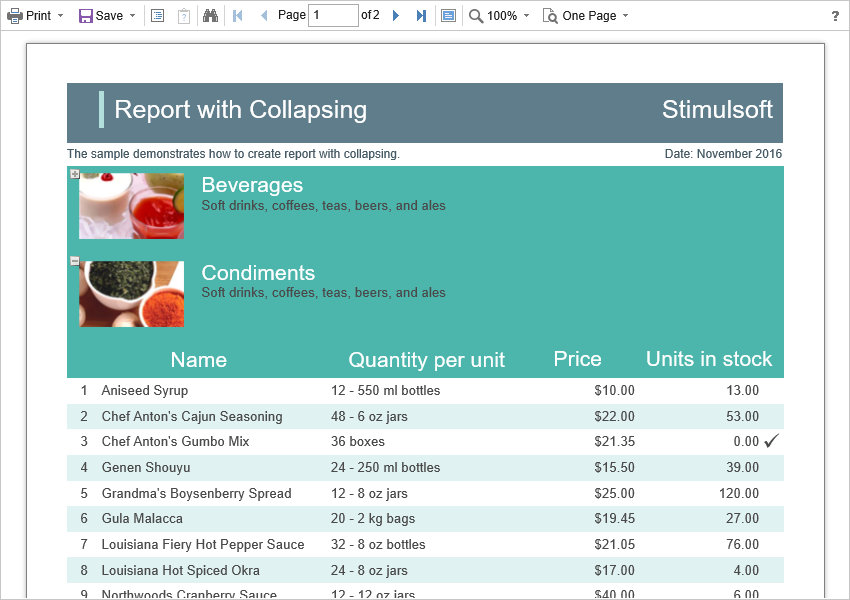

# Dynamic Sorting, Collapsing, and Drill-Down

The **HTML5 Viewer** component supports dynamic sorting, collapsing, and drill-down of reports. Dynamic sorting provides the ability to change the direction of sorting in a rendered report. To do this, click on the component that has dynamic sorting enabled. Dynamic sorting is carried out in the following directions - **Ascending** and **Descending**. Each time when you click the component, the sorting direction is reversed.


Multi-level sorting is allowed in the report. To do this, hold down the **Ctrl** key and sequentially click on the sorted components in the report. To reset sorting, you can click on any sorted component without holding down the **Ctrl** key.


A report with dynamic collapsing is an interactive report in which blocks can collapse/expand their content when you click on the block title. Report elements, which can be collapsed/expanded, are indicated by special icons - **[-]** or **[+]**.




When using drill-down, under the main panel of the viewer, the drill-down panel with tabs for drill-down reports will be displayed. The currently displayed report will be highlighted.


To work with dynamic sorting, collapsing, and drill-down reports, no additional viewer settings are required. To perform any actions before the sorting, collapsing, or drill-down of the report, a special **OnInteraction** event is used. It will be called when interacting with the viewer. For each type of interactivity, the viewer has a certain type of action.

* **Sorting** – when using column sorting;

* **DrillDown** – when using drill-down;

* **Collapsing** – when using collapsing.


**Default.aspx**

```
...
<cc1:StiWebViewer ID="StiWebViewer1" runat="server"
    OnInteraction="StiWebViewer1_Interaction">
</cc1:StiWebViewer>
...
```


**Default.aspx.cs**

```csharp
...
protected void StiWebViewer1_Interaction(object sender, StiReportDataEventArgs e)
{
    switch (e.Action)
    {
        case StiAction.Sorting:
            break;
        
        case StiAction.DrillDown:
            break;
        
        case StiAction.Collapsing:
            break;
    }
}
...
```
