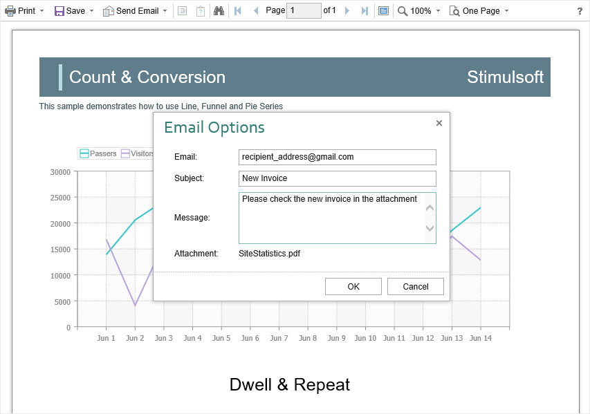

# Sending Report by Email

> **Information**
>
> Please note that the **Send Report** **by** **Email** option is available only for reports, and not for dashboards.

The **HTML5 Viewer** component provides the ability to send reports by email. To activate this feature, you should set the **ShowSendEmailButton** property of the viewer to **true** and define the **OnEmailReport** event handler.


**Default.aspx**

```
...
<cc1:StiWebViewer ID="StiWebViewer1" runat="server"
    ShowSendEmailButton="true"
    OnEmailReport="StiWebViewer1_EmailReport">
</cc1:StiWebViewer>
...
```


**Default.aspx.cs**

```csharp
...
protected void StiWebViewer1_EmailReport(object sender, StiEmailReportEventArgs e)
{
    StiExportFormat format = e.Format;
    StiReport report = e.Report;
    StiExportSettings settings = e.Settings;
    StiEmailOptions options = e.Options;
    
    // Passed from the viewer, can be checked and changed
    // options.AddressTo = "";
    // options.Subject = "";
    // options.Body = "";
    
    // Should be filled here
    options.AddressFrom = "admin_address@test.com";
    options.Host = "smtp.test.com";
    options.Port = 465;
    options.UserName = "admin_address@test.com";
    options.Password = "admin_password";
    
    // options.CC.Add("email@test.com");
    // options.BCC.Add("email@test.com");
    // options.EnableSsl = true;
}
...
```

In the **OnEmailReport** event, you can find the export type, get the report, and get the report export settings and change them, if necessary. Also, in this event, you should set email parameters, such as sender address, server name, port number, user name, and password - all these parameters will be used to send an email.


When you send a report by email, the menu to select the attachment format is displayed. This matches the menu to select an export format. After choosing the format, the dialog to put send email parameters such as email recipient, subject, and message.




After confirmation of sending the email, the above described **OnEmailReport** event will be called. You can check and correct the data entered in this form. The exported report file will be attached to the email automatically.


The **HTML5 Viewer** component allows you to set default values for the send email form. The **DefaultEmailAddress**, **DefaultEmailSubject**, and **DefaultEmailMessage** properties can be used for this. By default, these properties are empty.


**Default.aspx**

```
...
<cc1:StiWebViewer ID="StiWebViewer1" runat="server"
    DefaultEmailAddress="recipient_address@gmail.com"
    DefaultEmailSubject="New Invoice"
    DefaultEmailMessage="Please check the new invoice in the attachment"
    
    ShowSendEmailButton="true"
    OnEmailReport="StiWebViewer1_EmailReport">
</cc1:StiWebViewer>
...
```
