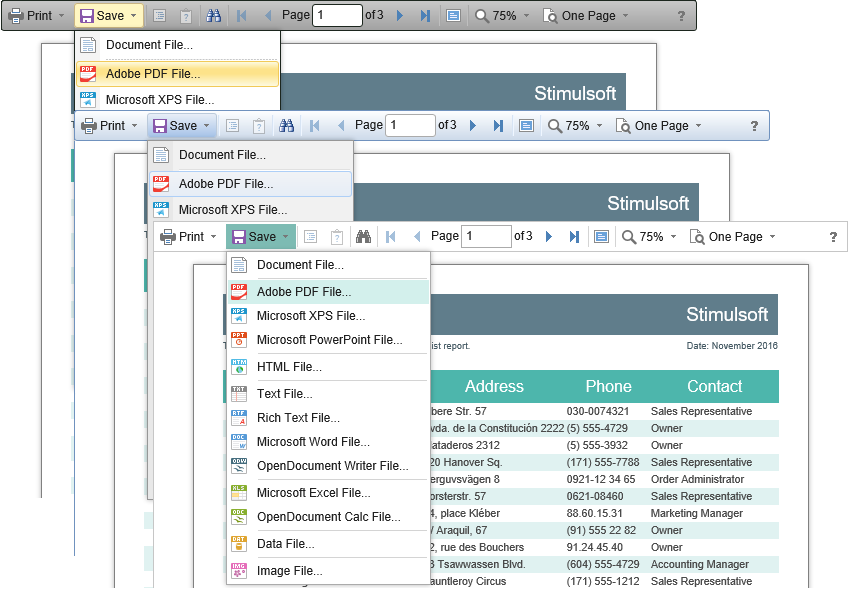

# Using Themes

In the **HTML5 Viewer** component, you can change the appearance of visual controls. To change the theme, you should use the **Theme** property.


**Default.aspx**

```
...
<cc1:StiWebViewer ID="StiWebViewer1" runat="server"
    Theme="Office2022WhiteTeal">
</cc1:StiWebViewer>
...
```

There are currently **8 themes** available with different color accents. As a result, **more than 60** variants of the appearance are available. This allows you to customize the appearance of the viewer for almost any design of the Web project.




By default, the viewer has only the top toolbar on which all the report controls are located. If necessary, the toolbar can be split into top and bottom parts. The top panel will contain the menu for printing and exporting the report and the buttons for working with parameters and bookmarks. The bottom panel will contain controls to switch between the report pages and setting the zoom of pages. To enable this mode, enable the **ToolbarDisplayMode** property. It has values **Simple** and **Separated**.


**Default.aspx**

```
...
<cc1:StiWebViewer ID="StiWebViewer1" runat="server"
    ToolbarDisplayMode="Separated"
    ScrollbarsMode="true">
</cc1:StiWebViewer>
...
```


In addition, it is possible to set the appearance parameters for the main elements of the viewer. For example, you can change the font and color of the control panel inscriptions of the viewer, set the background of the viewer, set the color of page borders, etc. Below is a list of available properties that change the appearance of the viewer and their default values.


**Default.aspx**

```
...
<cc1:StiWebViewer ID="StiWebViewer1" runat="server"
    BackgroundColor="White"
    ShowPageShadow="true"
    PageBorderColor="Gray"
    ToolbarBackgroundColor="Empty"
    ToolbarBorderColor="Empty"
    ToolbarFontColor="Empty"
    ToolbarFontFamily="Arial">
</cc1:StiWebViewer>
...
```
