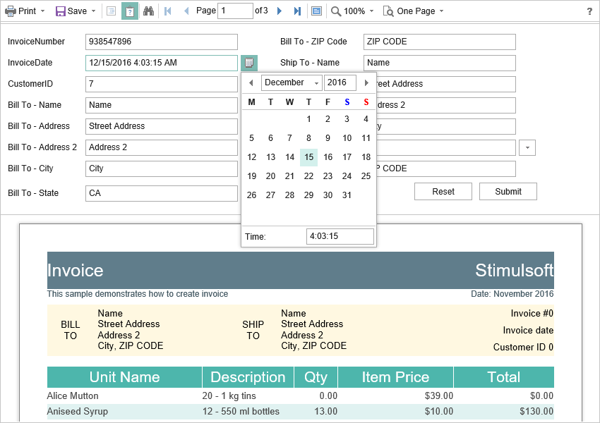

# Work with Parameters

To work with report parameters in the **Angular Viewer**, there is a special settings panel. To add a parameter to the panel you need to define a variable in a report, requested by the user. When viewing a report in the viewer such a variable will be automatically added to the settings panel. It supports all types of report variables (normal variables, date and time, borders, lists, etc.).




To work with reports with parameters, no additional viewer settings are required. If you need to perform some actions before applying the parameters, you can define a special **Interaction** action.


**HomeController.cs**

```csharp
...
public IActionResult InitViewer()
{
    var requestParams = StiAngularViewer.GetRequestParams(this);
    var options = new StiAngularViewerOptions();
    options.Actions.ViewerEvent = "ViewerEvent";
    options.Actions.Interaction = "ViewerInteraction";
    
    return StiAngularViewer.ViewerDataResult(requestParams, options);
}

public IActionResult ViewerInteraction()
{
    // Some code before any interaction
    // ...
    
    return StiAngularViewer.InteractionResult(this);
}
...
```

This action is called during any interactive actions of the viewer. If you need to perform any actions only when applying report parameters, you can use the parameters of the viewer. The viewer parameters are represented as an object of the **StiRequestParams** class, they are passed to any server side on any request, and contain all necessary information and states of the client part of the viewer. To determine the type of the action of the viewer, it is enough to check the **Action** property of the viewer parameters.


**HomeController.cs**

```csharp
...
public IActionResult ViewerInteraction()
{
    StiRequestParams requestParams = StiAngularViewer.GetRequestParams(this);
    if (requestParams.Action == StiAction.Variables)
    {
        // Some code before apply parameters
    }
    
    return StiAngularViewer.InteractionResult(this);
}
...
```

If you do not need to work with parameters, you can completely disable this feature. To do this, use the **ShowParametersButton** property in the **Toolbar** section of properties, which should be set to **false**.


**HomeController.cs**

```csharp
...
public IActionResult InitViewer()
{
    var requestParams = StiAngularViewer.GetRequestParams(this);
    var options = new StiAngularViewerOptions();
    options.Actions.ViewerEvent = "ViewerEvent";
    options.Toolbar.ShowParametersButton = false;
    
    return StiAngularViewer.ViewerDataResult(requestParams, options);
}
...
```


> **Information**
>
> With such a viewer configuration, the options panel will not be displayed, even if the parameters are present in the displayed report.
