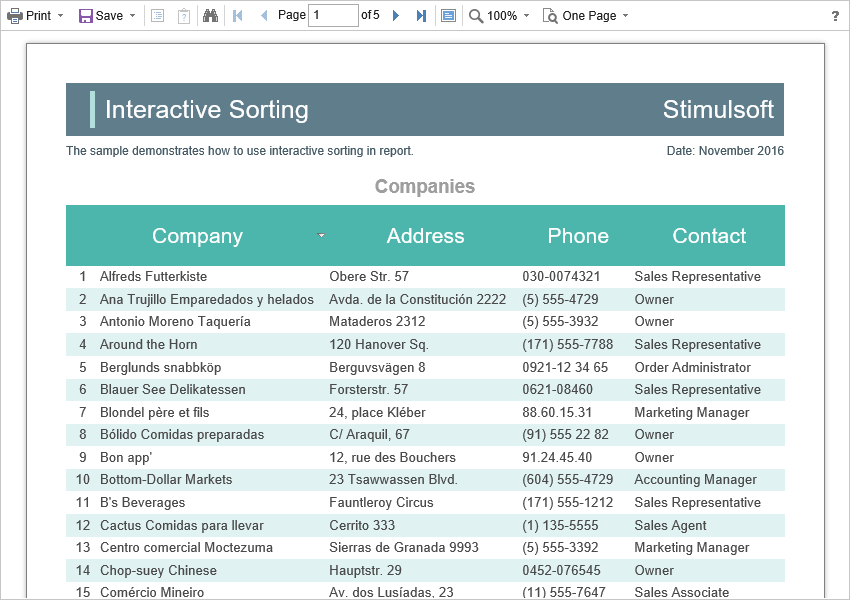

# Dynamic Sorting, Collapsing, and Drill-Down

The **Blazor Viewer** supports dynamic sorting, collapsing, and drill down in reports. Dynamic sorting allows changing the sort direction in a rendered report. To do it, you should click on the component in which dynamic sorting was set. Dynamic sorting is carried out in the following direction: **Ascending** and **Descending**. Each time when you click on some component, the direction is reversed.


Multilevel sorting is allowed in a report. To do it, you should hold down the **Ctrl** and, step-by-step, click on sorted report components. To reset the sort, you can click on any sorted report without holding down the **Ctrl**.




A report with dynamic collapsing is an interactive report where collapsing blocks can collapse/expand their content when clicking on the header of the block. The report elements which you can collapse/expand are highlighted with a special icon with **[-]** or **[+]**.


When data is drilled down under the main panel, the drill down panel with the bookmarks of drill down reports will be displayed. A displayed report now will be highlighted.


Additional viewer settings are not required for the work with dynamic sorting, collapsing, and drilling down. If you need to make some actions before sorting or drilling down a report, you can define the special **OnInteraction** event.


**Index.razor**

```
@using Stimulsoft.Report
@using Stimulsoft.Report.Blazor
@using Stimulsoft.Report.Web

<StiBlazorViewer OnInteraction="@OnInteraction" />

@code
{
    private void OnInteraction(StiReportDataEventArgs args)
    {
        // Some code before any interaction
        // ...
    }
}
```

To get an action type, you can use an event argument. A definite type of action is envisaged for each kind of viewer interaction:

* The **Sorting** **- w**hen using sorting and columns.

* The **DrillDown** - when using a report drill down.

* The **Collapsing** **-** when using a report blocks collapsing.


**Index.razor**

```
@using Stimulsoft.Report
@using Stimulsoft.Report.Blazor
@using Stimulsoft.Report.Web

<StiBlazorViewer OnInteraction="@OnInteraction" />

@code
{
    private void OnInteraction(StiReportDataEventArgs args)
    {
        switch (args.Action)
        {
            case StiAction.Sorting:
                break;
            
            case StiAction.DrillDown:
                break;
            
            case StiAction.Collapsing:
                break;
        }
    }
}
```
