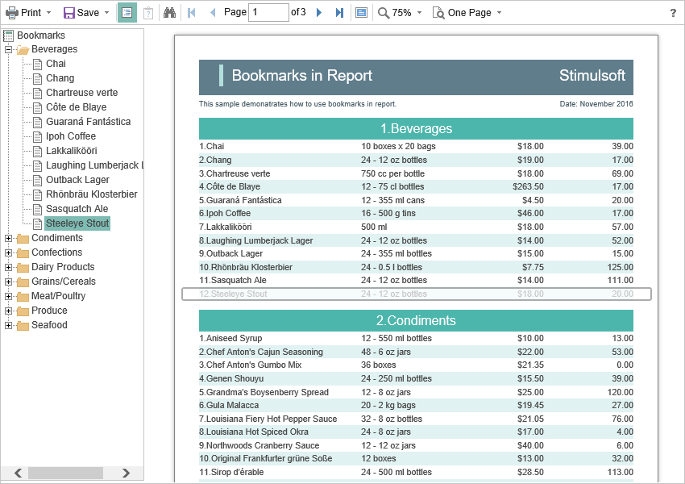

# Work with Bookmarks

The support of report bookmarks is implemented in the **Blazor Viewer** component. When displaying a report, the panel with bookmarks will be displayed to the left of the page. When selecting a bookmark for a report, the viewer will automatically transit to the page you need, and the report element with a bookmark will be highlighted.




By default, the width of the bookmark panel is 180 pixels; the **Blazor Viewer** component allows you to change this value. The **BookmarksTreeWidth** is intended for this. Its value is specified in pixels.


**Index.razor**

```
@using Stimulsoft.Report
@using Stimulsoft.Report.Blazor
@using Stimulsoft.Report.Web

<StiBlazorViewer Options="@Options" />

@code
{
    //Options object
    private StiBlazorViewerOptions Options;
    
    protected override void OnInitialized()
    {
        base.OnInitialized();
        
        //Init options object
        Options = new StiBlazorViewerOptions();
        Options.Appearance.BookmarksTreeWidth = 200;
    }
}
```

If the work with report bookmarks is not requested, you can completely disable this feature. The **ShowBookmarksButton** property is used for this, and it should be set to **false**.


**Index.razor**

```
@using Stimulsoft.Report
@using Stimulsoft.Report.Blazor
@using Stimulsoft.Report.Web

<StiBlazorViewer Options="@Options" />

@code
{
    //Options object
    private StiBlazorViewerOptions Options;
    
    protected override void OnInitialized()
    {
        base.OnInitialized();
        
        //Init options object
        Options = new StiBlazorViewerOptions();
        Options.Toolbar.ShowBookmarksButton = false;
    }
}
```


> **Information**
>
> In this case, report bookmarks won't be shown, even if they are present in a displayed report. This feature does not exert influence over printing and exporting a report.

When printing a report with bookmarks, the tree of bookmarks will be hidden. If apart from a report you need to print and bookmarks too, you should set the **BookmarksPrint** property to **true**.


**Index.razor**

```
@using Stimulsoft.Report
@using Stimulsoft.Report.Blazor
@using Stimulsoft.Report.Web

<StiBlazorViewer Options="@options" />

@code
{
    //Options object
    private StiBlazorViewerOptions options;
    
    protected override void OnInitialized()
    {
        base.OnInitialized();
        
        Stimulsoft.Base.StiFontCollection.AddFontFile("Fonts/Microsoft Sans Serif.ttf", "Segoe UI");
        
        //Init options object
        options = new StiBlazorViewerOptions();
        options.Appearance.BookmarksPrint = true;
    }
}
```
