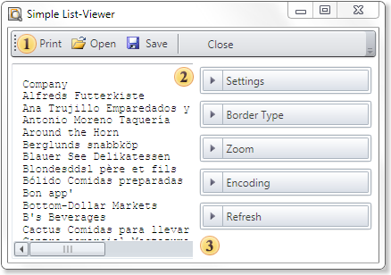
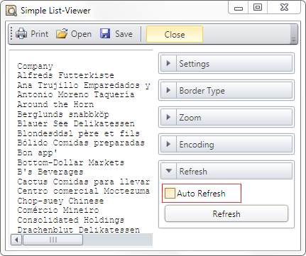

## Dot-Matrix Mode of Wpf Viewer

The **Dot-matrix** viewer is designed to preview the report before printing it on dot matrix printer. The Dot matrix printer is used to print only the text and characters of pseudographics. Accordingly the viewer displays only the text and borders of objects as pseudographics characters. The picture below shows the Dot-matrix viewer dialog box:





 The **Dot-Matrix** viewer toolbar.

 The panel displays the text of a report

 The options bar of a report.

### Dot-Matrix Viewer Settings for WPF

The Dot-Matrix viewer can be configured from code using static properties. Depending on the value of the static properties in the Dot-matrix viewer, these or that parameters will be specified. For example, the AutoRefresh property. The picture below shows the Dot-matrix viewer dialog box:


As can be seen on the picture above, the AutoRefresh property is enabled. This means that the AutoRefresh static property of the Dot-matrix viewer is set to true. If the AutoRefresh static property is set to false, then the AutoRefresh property in the Dot-matrix viewer is disabled. Add the following code into the project code:


**C#**

```csharp
...
StiOptions.Viewer.DotMatrix.AutoRefresh = false;
...
```

Thus, the **AutoRefresh** property will be disabled. The picture below shows the **Dot-matrix** viewer dialog box with disabled auto refresh function:




Most parameters can be set using the static properties.


### DotMatrix and Escape Codes

For inserting the escape sequence to text the commands that may look like <#command> should be used as seen in the code sample below:

Normal text <#b> Bold text <#/b><#i> Italic text <#/i> Again normal text

Also commands of selecting bold, italic or underlined text are automatically inserted depending on the style of the text box font. When printing to matrix printer and exporting to text format these commands are changed on appropriate escape sequences.

The **StiEscapeCodesCollection** is used for this process. It is inherited from the Hashtable class. This is a collection of "key-value" pairs where the key is the command and value is the escape-sequence. For different types of printers different collections with different set of command can be defined. Collections are stored in the **StiOptions.Export.Txt.EscapeCodesCollectionList** static variable. By default, the following collections will be created: "None", "EpsonFX", "Oki ML92/93". The "None" collection is empty and used to output the text without escape codes.


| b | ESC E | ESC T |
| --- | --- | --- |
| /b | ESC F | ESC I |
| i | ESC 4 |  |
| /i | ESC 5 |  |
| u | ESC -1 | ESC H |
| /u | ESC -0 | ESC D |
| sup | ESC S0 | ESC J |
| /sup | ESC T | ESC K |
| sub | ESC S1 | ESC L |
| /sub | ESC T | ESC M |
| condensed | 0x0F | 0x1d |
| /condensed | 0x12 | 0x1e |
| elite | ESC M | 0x1c |
| pica | ESC P | 0x1e |
| doublewidth | ESC W1 | 0x1f |
| /doublewidth | ESC W0 | 0x1e |

It is possible to add new collections of change the existing ones. The selection of the required collection is done by the name. If the collection with the name is not found then the "None" collection is used. The collection name can be selected from the DotMatrixViewer settings and passed as an option to the exporting and printing methods.
