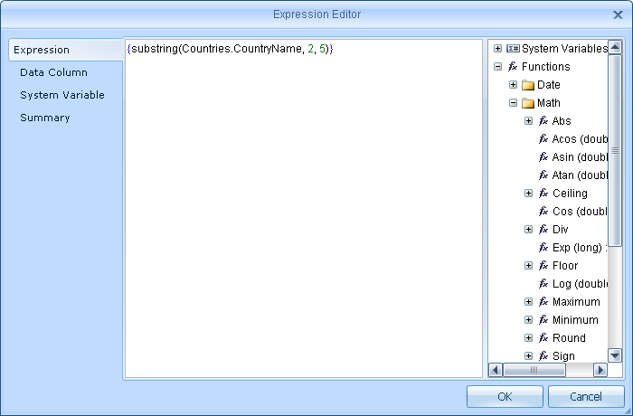

# Custom Functions

In addition to the standard (built-in) functions, there is an ability to define your own (custom) functions. To do this, we have the list customFunctions implemented in the class **StiReport**. Before rendering a report all required functions must be added in it. Classes of user-defined functions must implement the interface **com.stimulsoft.report.StiCustomFunction**. The description of the interface **StiCustomFunction**:


* **public String getFunctionName()** – the function class should return the name of the custom function. Register is taken into account. Do not use the names of existing built-in functions, methods, variables, reserved words as true/false/null, etc.

* **public List&lt;Class&gt; getParametersList()** – the function class should return a list of classes of variables used in the custom function.

* **public Object invoke(List&lt;Object&gt; args)** –  there must be a realization of a custom function.


An example of using on the base of **Samples\webfx\**. Suppose you need to implement a custom **substring** function. In the class **my.actions.MyRenderReportAction** write the following:


**webfx**

```
...
public StiReport render(StiReport report) throws IOException, StiException {
    report.getCustomFunctions().add(new StiCustomFunction() {
        public Object invoke(List<Object> args) {
            return ((String) args.get(0)).substring((Integer)args.get(1), (Integer) args.get(2));
        }

        public List<Class> getParametersList() {
            return new ArrayList<Class>(Arrays.asList(String.class, Integer.class, Integer.class));
        }

        public String getFunctionName() {
            return "substring";
        }
    });
    return super.render(report);
}
...
```

Now you can use a custom substring function in a report:



