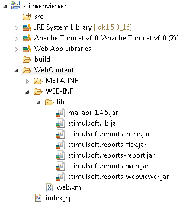

# Create a Sample Page With Report Angular Viewer

Create a simple page with a report webviewer. To do this, put the following libraries into the **WebContent\WEB-INF\lib\** directory: stimulsoft.lib.jar, stimulsoft.reports-base.jar, stimulsoft.reports-report.jar, stimulsoft.reports-flex.jar, stimulsoft.reports-web.jar, stimulsoft.reports-webviewer.jar . As a result, one can see the following (Figure 8):




Next, open the web.xml for editing, it should look like in Listing 2:


**web.xml**

```xml
...
<?xml version="1.0" encoding="UTF-8" ?>
<web-app xmlns:xsi="http://www.w3.org/2001/XMLSchema-instance"
    xmlns="http://java.sun.com/xml/ns/javaee" xmlns:web="http://java.sun.com/xml/ns/javaee/webapp_2_5.xsd"
    xsi:schemaLocation="http://java.sun.com/xml/ns/javaee"
    id="WebApp_ID" version="2.5">
    <display-name>sti_webviewer</display-name>
    <welcome-file-list>
        <welcome-file>index.jsp</welcome-file>
    </welcome-file-list>
    <!-- configuration, this parameter indicates the main application directory -->
    <servlet>
        <servlet-name>StimulsoftResource</servlet-name>
        <servlet-class>com.stimulsoft.web.servlet.StiWebResourceServlet</servlet-class>
    </servlet>
    <servlet-mapping>
        <servlet-name>StimulsoftResource</servlet-name>
        <url-pattern>/stimulsoft_web_resource</url-pattern>
    </servlet-mapping>
    <servlet>
        <servlet-name>StimulsoftAction</servlet-name>
        <servlet-class>com.stimulsoft.webviewer.servlet.StiWebViewerActionServlet</servlet-class>
    </servlet>
    <servlet-mapping>
        <servlet-name>StimulsoftAction</servlet-name>
        <url-pattern>/stimulsoft_webviewer_action</url-pattern>
    </servlet-mapping>
</web-app>
...
```

Leave unchanged the remaining **web.xml** blocks, which defines the servlets required for working. Then, edit the **index.jsp** (Listing 4).


**index.jsp**

```
...
<!DOCTYPE html PUBLIC "-//W3C//DTD XHTML 1.0 Strict//EN" "http://www.w3.org/TR/xhtml1/DTD/xhtml1-strict.dtd">
<%@page import="com.stimulsoft.report.StiReport"%>
<%@ page language="java" contentType="text/html; charset=utf-8"
    pageEncoding="UTF-8"%>
<%@ taglib uri="http://stimulsoft.com/webviewer" prefix="stiwebviewer"%>
<html xmlns="http://www.w3.org/1999/xhtml">
<head>
<title>Stimulsoft Reports for Java</title>
<stiwebviewer:resources />
<style type="text/css">
.t1 td {
    padding-right: 30px
}
</style>
</head>
<body>
    <%
        pageContext.setAttribute("report", new StiReport());
    %>
    <h1 align="center">My first report!</h1>
    <stiwebviewer:webviewer  report="${report}" />
</body>
</html>
...
```

It will display empty webviewer (because of empty StiReport object). Add taglib directives in the JSP. They will work with custom tags on the page.


**Custom Stimulsoft tag**

```
...
<%@ taglib uri="http://stimulsoft.com/webviewer" prefix="stiwebviewer"%>
...
```

Add a tag  <stiwebviewer:resources />, tag used to load necessary resources (css & js) for webviewer, it haven’t any attributes, it must be placed inside HTML &lt;head&gt; tag.
