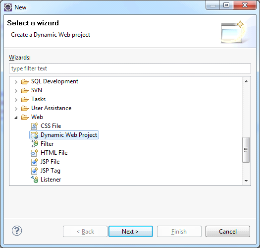
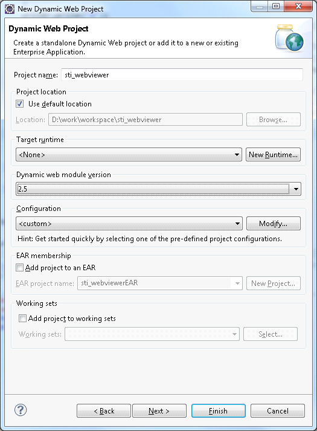
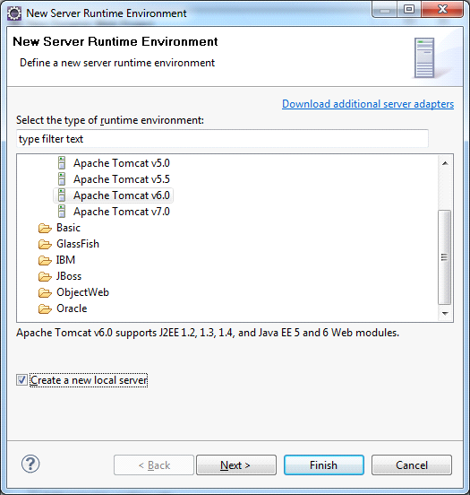
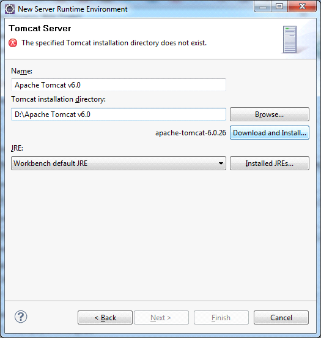

# Creating Project

Launch the **Eclipse IDE**, choose **File> New> Project**. In the project wizards open the Web type and in the drop-down list select **Dynamic Web Project** wizard and click Next (Figure 1). Select dynamic Web project:

In the window opened fill in the Project name (e.g. sti_webviewer, as shown on Figure2). Then configure the web server, on which the application will run. Create a new dynamic Web project:

* **Target a runtime**

Under Target Runtime, you see <None>, as shown in Figure 1, because you haven't created a runtime yet for Apache Tomcat. Click New Runtime to open the New Target Runtime Wizard. Select Apache Tomcat of the required version from the list of available, check the Create a new local server as shown in Figure 3, then click Next.

* **Target a runtime**

Under Target Runtime, you see <None>, as shown in Figure 1, because you haven't created a runtime yet for Apache Tomcat. Click New Runtime to open the New Target Runtime Wizard. Select Apache Tomcat of the correct version from a list. Check Create a new local server as shown on Figure 3, then click Next.Create a new server runtime:

Then define the Tomcat installation directory, in which Apache Tomcat is installed, or in which one needs to install it, as shown on Figure 4. If it is not installed, then click Download and Install. After all fields are specified, click Finish. Define the server location:

