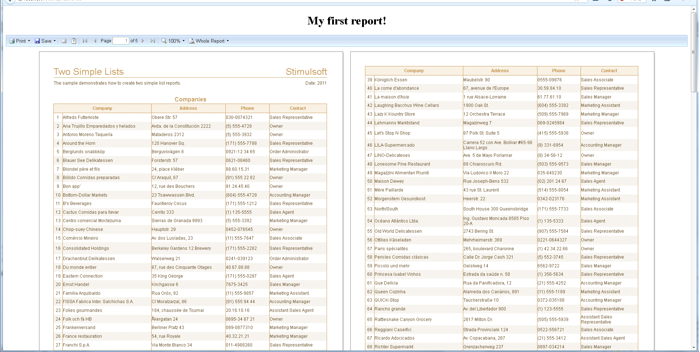

# Description of Webviewer Tag

**index.jsp**

```
...
<stiwebviewer:webviewer  report="${report}" />
...
```

This tag contains next attributes:

* **report** [required] – StiReport object to display in webviewer;

* **options** [optional] – StiWebViewerOptions object to customize webviewer. If not present – default options are used;

* **viewerID** [optional] – String value identifier of webviewer HTML element. If more than one webviewer present in HTML page each webviewer must have different identifier.

**Example of usage webviewer tag** (display generated (mdc) report from d:\repots\TwoSimpleLists.mdc with custom parameters)


**index.jsp**

```
...
<!DOCTYPE html PUBLIC "-//W3C//DTD XHTML 1.0 Strict//EN" "http://www.w3.org/TR/xhtml1/DTD/xhtml1-strict.dtd">
<%@page import="com.stimulsoft.webviewer.enums.StiWebViewerTheme"%>
<%@page import="com.stimulsoft.webviewer.enums.StiPagesViewMode"%>
<%@page import="com.stimulsoft.webviewer.StiWebViewerOptions"%>
<%@page import="java.io.File"%>
<%@page import="com.stimulsoft.report.StiSerializeManager"%>
<%@page import="com.stimulsoft.report.StiReport"%>
<%@ page language="java" contentType="text/html; charset=utf-8"
    pageEncoding="UTF-8"%>
<%@ taglib uri="http://stimulsoft.com/webviewer" prefix="stiwebviewer"%>
<html xmlns="http://www.w3.org/1999/xhtml">
<head>
<title>Stimulsoft Reports for Java</title>
<stiwebviewer:resources />
</head>
<body>
    <%
        StiReport report = StiSerializeManager.deserializeDocument(new File("d:/reports/TwoSimpleLists.mdc")).getReport();
        StiWebViewerOptions options = new StiWebViewerOptions();
        options.setTheme(StiWebViewerTheme.Office2007Blue);
        options.setPagesViewMode(StiPagesViewMode.WholeReport);
        
        pageContext.setAttribute("report", report);
        pageContext.setAttribute("options", options);
    %>
    <h1 align="center">My first report!</h1>
    <stiwebviewer:webviewer  report="${report}" options="${options}"/>
</body>
</html>
...
```


