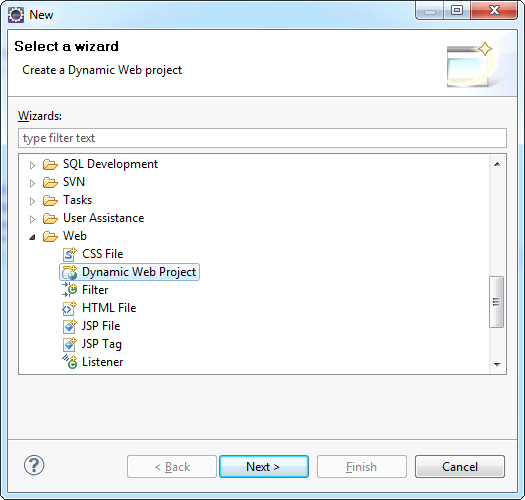
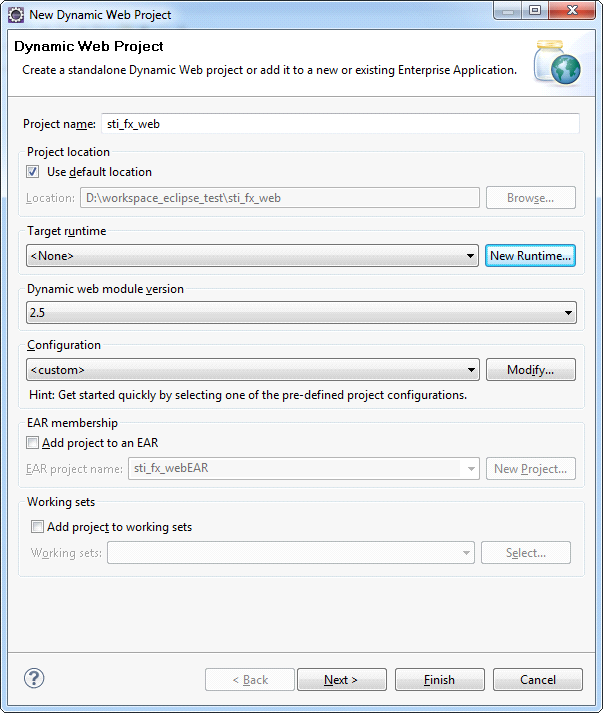

## Creating Project

Launch the Eclipse IDE, choose **File&gt; New&gt; Project**. In the project wizards open the **Web** type and in the drop-down list select **Dynamic Web Project** wizard and click **Next** (See the picture below):

In the window opened fill in the **Project name** (e.g. **sti_fx_web**, as shown in the picture below). Then configure the web server, on which the application will run.

