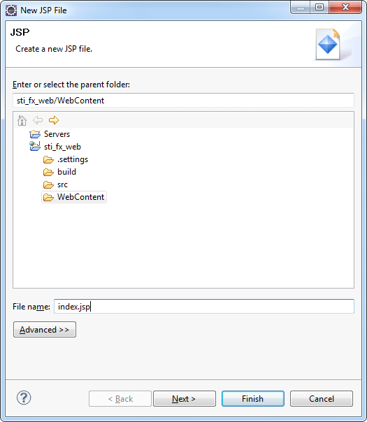
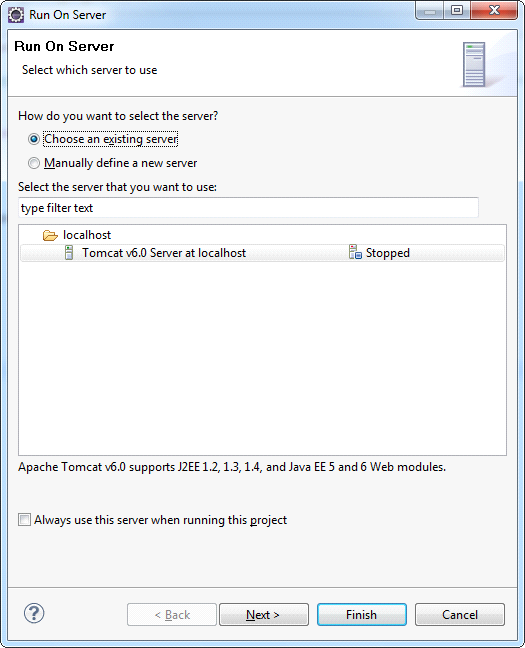
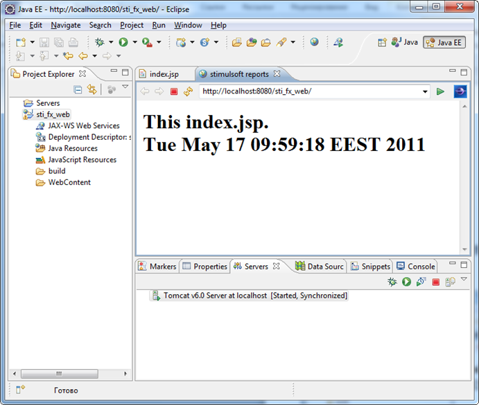

## Creating Sample

In order to verify the project and the Tomcat server, create a simple JSP and deploy it on Tomcat. To do this, one can create a new JSP, by choosing **File> New> Other**, or one can use the context menu, right-click the project name in the **Project Explorer** and select **New> JSP file**. In the next window (see the picture) define the directory Web Content, and in the **File name** write **index.jsp**. Click **Finish** to create pages using the default template.




Now open the **index.jsp** and edit it so that it displays the current date. The code page is specified in the code:


**index.jsp**

```

<!DOCTYPEhtmlPUBLIC"-//W3C//DTD HTML 4.01 Transitional//EN">
<%@ page language="java" contentType="text/html; charset=UTF-8" pageEncoding="UTF-8" %>
<html>
<head>
<meta http-equiv="Content-Type" content="text/html; charset=UTF-8">
<title>stimulsoft reports</title>
</head>
<body>
    <%java.util.Date date = new java.util.Date();%>
        <h1>
            This index.jsp.<br>
            <%=date.toString()%>
        </h1>
</body>
</html>
```

Now deploy it on the server. For this one need to use the context menu, right-click the project name, select **Run> Run as> Run on server**. Define a previously created server and click **Finish**.




As a result, you receive the following (see the picture below). This page will be available from any browser at **http://localhost:8080/{ProjectName}** (where the **{ProjectName}** name of the created project, in our case **sti_fx_web**).



